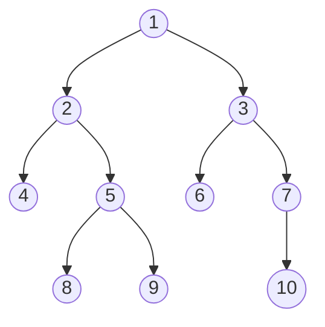
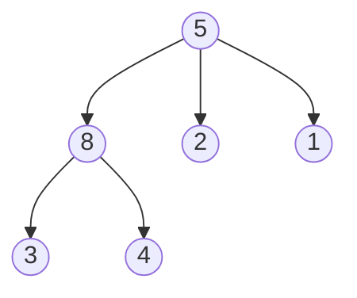
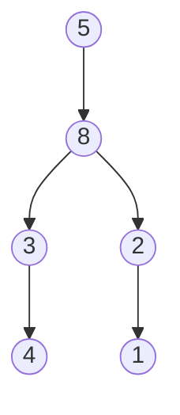
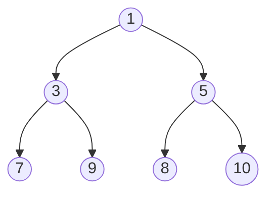
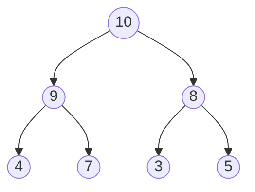

Trees and graphs: Binary trees; binary tree representation; binary tree traversal - inorder, preorder, and postorder, binary tree representation of trees, heaps, graph representation, graph traversals, shortest path, complexities of operations in trees and graphs.

Before you get started, make sure you remember the following:

1. [[Calculating Height & Width of a Tree]]
2. The meaning of `root`, `child`, `leaf`, `edge`, `siblings`
3. An **ordered tree** is a tree where the **children of each node have a specific order** — like first child, second child, third child, and so on.
   We usually show this by drawing the children **from left to right** in the order they belong.

## Trees and Graphs

### Binary Trees



A **binary tree** is an ordered tree with the following properties:

> 1. Every node has at most two children.
> 2. Each child node is labeled as being either a left child or a right child.
> 3. A left child precedes a right child in the order of children of a node

```ts
type TreeNode = {
  id: string;
  value: number;
  sibling: TreeNode | null; // optionally store your sibling
  left: TreeNode | null;
  right: TreeNode | null;
};
```

> [!warning] I left out adding and removing nodes as you're probably familiar with how its done by now (same concepts as lists)

More boring facts:

- The **root** node is the entry point. Leaves are nodes with no children.
- A binary tree is _proper_ if each node has either zero or two children.
- _The recursive definition:_ a binary tree has a root, the root has 0 to 2 binary trees as children (left subtree, right subtree)

> [!tip] Binary Search Trees  
> A **Binary Search Tree (BST)** is a special kind of binary tree where:
>
> - Left child < parent
> - Right child > parent  
>    Useful for fast lookup, insertion, and deletion.
>   With a time complexity of **O(log n)** in the **average** and **best** cases.

> [!Warning] I left out rotations when removing from BSTs, as BST wasn't mentioned in the topics list.
> However.. BSTs are binary-trees, so maaybe they are included? idk 🤷🏻‍♂️

#### Binary Tree Traversals

Tree traversals are ways to "walk through" the tree. There are three main types:

### 1. Inorder (Left → Root → Right)

```ts
function inorder(node: TreeNode | null) {
  if (!node) return;
  inorder(node.left);
  console.log(node.value);
  inorder(node.right);
}
```

> [!tip] In BSTs, inorder gives you values in **sorted order**.
> A way of sorting an array of numbers is to push its elements into a new BST and then traverse and pop them back using inorder traversal! :D

### 2. Preorder (Root → Left → Right)

```ts
function preorder(node: TreeNode | null) {
  if (!node) return;
  console.log(node.value);
  preorder(node.left);
  preorder(node.right);
}
```

### 3. Postorder (Left → Right → Root)

```ts
function postorder(node: TreeNode | null) {
  if (!node) return;
  postorder(node.left);
  postorder(node.right);
  console.log(node.value);
}
```

> [!Note]
> All of these are example of Depth-First Search (DFS).
> I left out Breadth-First Search (BFS), used for finding the shortest path, as it wasn't mentioned in the topics list, however it might be useful to go throw it.
> We will also visit it briefly in Graph traversals.

---

#### Normal Tree → Binary Tree Representation

_Prepare for a headache, this is a bit confusing but bear with me_

Any general tree (where a node can have more than 2 children) can be represented as a **binary tree** using the **Left-Child Right-Sibling** technique:

- Left child → first child
- Right child → next sibling

In other non-confusing words:

start with root:

- The first child (let's call it `1st`) of a node stays in the same place on the left.
- The next child (`2nd`) becomes the right child of `1st`.
- The next child (`3rd`) becomes the right child of `2nd`.
  and so on.. once there are no more children, do the same for the other nodes, starting with `1st`.

Let's see an example:

Original tree:



Converted to binary tree using Left-Child Right-Sibling representation:



Notice how:

1. B (first child of A) stays as left child of A
2. C (second child of A) becomes right child of B
3. D (third child of A) becomes right child of C
4. E (first child of B) stays as left child of B
5. F (second child of B) becomes right child of E

Confusing right? ahahah will probably be in the exam.
I would personally just keep first 2 nodes and push the rest down the tree until a space is available, but what do I know.

---

## Heaps

A **Heap** is a complete binary tree that satisfies the **heap property**.

- **Min-Heap**: Parent is less than both children

- **Max-Heap**: Parent is greater than both children

### Benefits

- Efficient retrieval of the minimum or maximum element.
- As a result, heaps are often used to implement priority queues.
  A **priority queue** is an abstract data type where each element has a "priority" associated with it. Elements with higher priority are served before elements with lower priority.
- We also use heaps to implement heapsort, which is a sorting algorithm that uses the heap data structure.
  The heapsort algorithm works by first building a max-heap from the input data, and then repeatedly extracting the maximum element from the heap and rebuilding the heap until all elements are sorted.
  - Time complexity: O(n log n)
  - Time complexity of building the heap: O(n)

> [!Note] Heaps are not sorted, but they are partially ordered. The root node is always the minimum (or maximum) element.

### Representation

A heap is a complete binary tree, meaning all levels are fully filled except possibly the last level, which is filled from left to right.

An example of min-heap:



An example of max-heap:



Heaps are often stored as arrays. For any node at index i:

- Left child: `2i + 1`
- Right child: `2i + 2`
- Parent: `Math.floor((i - 1) / 2)`

For example, this max-heap:


Can be stored as array: `[10, 9, 8, 4, 7, 3, 5]`

take `8` for example, with index `2`:
The index of the children and parent are:

- Left child: `2 * 2 + 1 = 5`
- Right child: `2 * 2 + 2 = 6`
- Parent: `Math.floor((2 - 1) / 2) = 0`

### Heap Operations

First, a heap is JUST an array:

```ts
type Heap = number[];
```

#### 1. Insertion (O(log n))

```typescript
function insert(heap: Heap, value: number) {
  heap.push(value);
  bubbleUp(heap, heap.length - 1);
}

function bubbleUp(heap: number[], index: number) {
  while (index > 0) {
    const parentIdx = Math.floor((index - 1) / 2);
    if (heap[parentIdx] >= heap[index]) break; // for max-heap
    [heap[parentIdx], heap[index]] = [heap[index], heap[parentIdx]];
    index = parentIdx;
  }
}
```

#### 2. Extract Max/Min (O(log n))

```typescript
function extractMax(heap: Heap): number {
  if (heap.length === 0) return -1;

  const max = heap[0];
  heap[0] = heap[heap.length - 1];
  heap.pop();
  bubbleDown(heap, 0);

  return max;
}

function bubbleDown(heap: Heap, index: number) {
  while (true) {
    let largest = index;
    const left = 2 * index + 1;
    const right = 2 * index + 2;

    if (left < heap.length && heap[left] > heap[largest]) largest = left;
    if (right < heap.length && heap[right] > heap[largest]) largest = right;

    if (largest === index) break;

    [heap[index], heap[largest]] = [heap[largest], heap[index]];
    index = largest;
  }
}
```

#### 3. Building a Heap (O(n))

```typescript
function buildHeap(array: number[]) {
  const firstNonLeaf = Math.floor(array.length / 2) - 1;
  for (let i = firstNonLeaf; i >= 0; i--) {
    bubbleDown(array, i);
  }
  return array;
}
```

> [!tip] Applications
>
> - Priority Queues
> - Heap Sort
> - Finding k-th largest/smallest element
> - Median maintenance

---

## Graphs

A **graph** is a set of **nodes (vertices)** and **edges** connecting them.

```ts
type Graph = {
  [node: string]: string[]; // adjacency list representation
};
```

### Types

- **Directed** vs **Undirected**
- **Weighted** vs **Unweighted**
- **Cyclic** vs **Acyclic**
- **Connected** vs **Disconnected**

---

## Graph Representations

### 1. Adjacency Matrix

```ts
const matrix = [
  [0, 1, 0],
  [1, 0, 1],
  [0, 1, 0]
];
```

- Good for dense graphs
- Space: `O(n^2)`

### 2. Adjacency List

```ts
const adjList = {
  A: ["B"],
  B: ["A", "C"],
  C: ["B"]
};
```

- Good for sparse graphs
- Space: `O(V + E)`

---

## Graph Traversals

### 1. Depth-First Search (DFS)

```ts
function dfs(graph: Graph, start: string, visited = new Set()) {
  if (visited.has(start)) return;
  visited.add(start);
  console.log(start);
  for (const neighbor of graph[start]) {
    dfs(graph, neighbor, visited);
  }
}
```

### 2. Breadth-First Search (BFS)

```ts
function bfs(graph: Graph, start: string) {
  const queue = [start];
  const visited = new Set([start]);

  while (queue.length) {
    const node = queue.shift()!;
    console.log(node);

    for (const neighbor of graph[node]) {
      if (!visited.has(neighbor)) {
        visited.add(neighbor);
        queue.push(neighbor);
      }
    }
  }
}
```

> [!tip] BFS is great for finding the shortest path in **unweighted graphs**.

---

## Shortest Path Algorithms

### 1. Dijkstra’s Algorithm (for weighted graphs)

- Keeps track of the shortest known distance to each node.
- Uses a **min-priority queue** (often implemented with a heap).
- Time Complexity: `O((V + E) log V)` with a binary heap.

### 2. BFS (for unweighted graphs)

- Since every edge has equal weight, BFS gives the shortest path in `O(V + E)` time.

---

## Time & Space Complexities (Cheat Sheet)

| Structure / Operation      | Time Complexity          |
| -------------------------- | ------------------------ |
| **Binary Tree (search)**   | O(n)                     |
| **Binary Search Tree**     | O(log n) avg, O(n) worst |
| **Heap (insert/delete)**   | O(log n)                 |
| **DFS/BFS (adj list)**     | O(V + E)                 |
| **DFS/BFS (adj matrix)**   | O(V²)                    |
| **Dijkstra (binary heap)** | O((V + E) log V)         |
