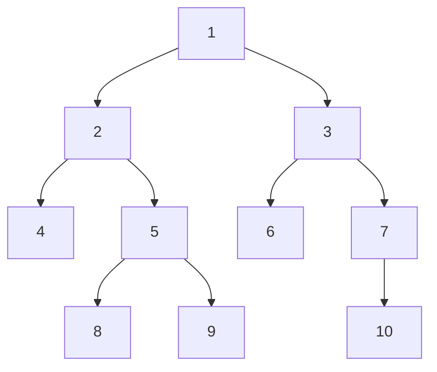

Trees and graphs: Binary trees; binary tree representation; binary tree traversal - inorder, preorder, and postorder, binary tree representation of trees, heaps, graph representation, graph traversals, shortest path, complexities of operations in trees and graphs.  


---

## Trees and Graphs
## Binary Trees


A **binary tree** is an ordered tree with the following properties:

> 1. Every node has at most two children.
> 2. Each child node is labeled as being either a left child or a right child. 
> 3. A left child precedes a right child in the order of children of a node


```ts
type TreeNode = {
  value: number;
  left: TreeNode | null;
  right: TreeNode | null;
};
```

The **root** node is the entry point. Leaves are nodes with no children.

> [!tip] Binary Search Trees  
> A **Binary Search Tree (BST)** is a special kind of binary tree where:
> 
> - Left child < parent
>     
> - Right child > parent  
>     Useful for fast lookup, insertion, and deletion.
>     

---

## Binary Tree Traversals

Tree traversals are ways to "walk through" the tree. There are three main types:

### 1. Inorder (Left → Root → Right)

```ts
function inorder(node: TreeNode | null) {
  if (!node) return;
  inorder(node.left);
  console.log(node.value);
  inorder(node.right);
}
```

> [!note] In BSTs, inorder gives you values in **sorted order**.

### 2. Preorder (Root → Left → Right)

```ts
function preorder(node: TreeNode | null) {
  if (!node) return;
  console.log(node.value);
  preorder(node.left);
  preorder(node.right);
}
```

### 3. Postorder (Left → Right → Root)

```ts
function postorder(node: TreeNode | null) {
  if (!node) return;
  postorder(node.left);
  postorder(node.right);
  console.log(node.value);
}
```

---

## Tree → Binary Tree Representation

Any general tree (where a node can have more than 2 children) can be represented as a **binary tree** using the **Left-Child Right-Sibling** technique:

- Left child → first child
    
- Right child → next sibling
    

This keeps binary tree operations usable while representing n-ary trees.

---

## Heaps

A **Heap** is a complete binary tree that satisfies the **heap property**.

- **Min-Heap**: Parent is less than both children
    
- **Max-Heap**: Parent is greater than both children
    

Heaps are often stored as arrays.

### Example: Max-Heap stored in array

```
Index:  0   1   2   3   4
Value: [50, 30, 40, 10, 20]
```

```ts
const leftChild = (i: number) => 2 * i + 1;
const rightChild = (i: number) => 2 * i + 2;
const parent = (i: number) => Math.floor((i - 1) / 2);
```

> [!tip] Use Heaps for Priority Queues  
> Insertion and deletion: `O(log n)`

---

## Graphs

A **graph** is a set of **nodes (vertices)** and **edges** connecting them.

```ts
type Graph = {
  [node: string]: string[]; // adjacency list representation
};
```

### Types

- **Directed** vs **Undirected**
    
- **Weighted** vs **Unweighted**
    
- **Cyclic** vs **Acyclic**
    
- **Connected** vs **Disconnected**
    

---

## Graph Representations

### 1. Adjacency Matrix

```ts
const matrix = [
  [0, 1, 0],
  [1, 0, 1],
  [0, 1, 0],
];
```

- Good for dense graphs
    
- Space: `O(n^2)`
    

### 2. Adjacency List

```ts
const adjList = {
  A: ['B'],
  B: ['A', 'C'],
  C: ['B'],
};
```

- Good for sparse graphs
    
- Space: `O(V + E)`
    

---

## Graph Traversals

### 1. Depth-First Search (DFS)

```ts
function dfs(graph: Graph, start: string, visited = new Set()) {
  if (visited.has(start)) return;
  visited.add(start);
  console.log(start);
  for (const neighbor of graph[start]) {
    dfs(graph, neighbor, visited);
  }
}
```

### 2. Breadth-First Search (BFS)

```ts
function bfs(graph: Graph, start: string) {
  const queue = [start];
  const visited = new Set([start]);

  while (queue.length) {
    const node = queue.shift()!;
    console.log(node);

    for (const neighbor of graph[node]) {
      if (!visited.has(neighbor)) {
        visited.add(neighbor);
        queue.push(neighbor);
      }
    }
  }
}
```

> [!tip] BFS is great for finding the shortest path in **unweighted graphs**.

---

## Shortest Path Algorithms

### 1. Dijkstra’s Algorithm (for weighted graphs)

- Keeps track of the shortest known distance to each node.
    
- Uses a **min-priority queue** (often implemented with a heap).
    
- Time Complexity: `O((V + E) log V)` with a binary heap.
    

### 2. BFS (for unweighted graphs)

- Since every edge has equal weight, BFS gives the shortest path in `O(V + E)` time.
    

---

## Time & Space Complexities (Cheat Sheet)

|Structure / Operation|Time Complexity|
|---|---|
|**Binary Tree (search)**|O(n)|
|**Binary Search Tree**|O(log n) avg, O(n) worst|
|**Heap (insert/delete)**|O(log n)|
|**DFS/BFS (adj list)**|O(V + E)|
|**DFS/BFS (adj matrix)**|O(V²)|
|**Dijkstra (binary heap)**|O((V + E) log V)|

