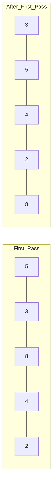
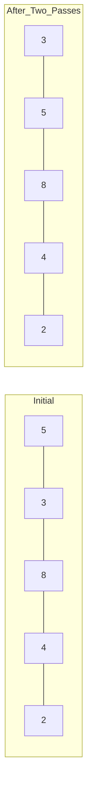
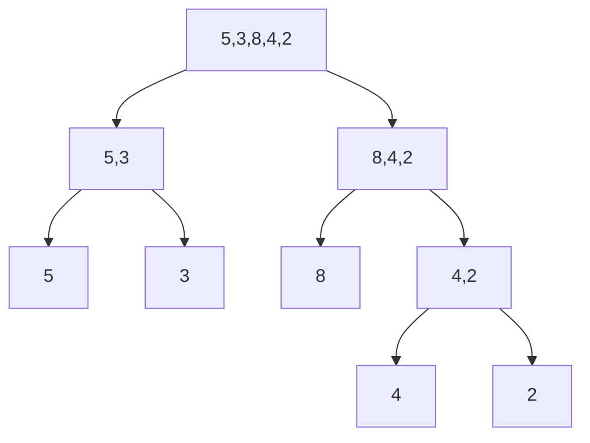
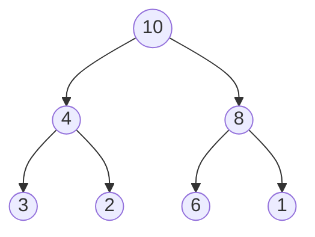

# Sorting Algorithms

Common sorting algorithms and their characteristics.

## Quick Reference

| Algorithm      | Time (Avg) | Time (Worst) | Space    | Stable |
| -------------- | ---------- | ------------ | -------- | ------ |
| Bubble Sort    | O(n²)      | O(n²)        | O(1)     | Yes    |
| Insertion Sort | O(n²)      | O(n²)        | O(1)     | Yes    |
| Quick Sort     | O(n log n) | O(n²)        | O(log n) | No     |
| Merge Sort     | O(n log n) | O(n log n)   | O(n)     | Yes    |
| Heap Sort      | O(n log n) | O(n log n)   | O(1)     | No     |

## Bubble Sort

Repeatedly steps through the list, compares adjacent elements and swaps them if they are in the wrong order.



```typescript
function bubbleSort(arr: number[]): number[] {
  const n = arr.length;
  for (let i = 0; i < n; i++) {
    for (let j = 0; j < n - i - 1; j++) {
      if (arr[j] > arr[j + 1]) {
        [arr[j], arr[j + 1]] = [arr[j + 1], arr[j]];
      }
    }
  }
  return arr;
}
```

## Insertion Sort

Builds the final sorted array one item at a time, by repeatedly inserting a new element into the sorted portion of the array.



```typescript
function insertionSort(arr: number[]): number[] {
  for (let i = 1; i < arr.length; i++) {
    const key = arr[i];
    let j = i - 1;
    while (j >= 0 && arr[j] > key) {
      arr[j + 1] = arr[j];
      j--;
    }
    arr[j + 1] = key;
  }
  return arr;
}
```

## Quick Sort

Uses a divide-and-conquer strategy. Picks a 'pivot' element and partitions the array around it.

```mermaid
graph TD
    A[5,3,8,4,2] --> B[2,3,4 | 5 | 8]
    B --> C[2,3,4]
    B --> D[8]
    C --> E[2 | 3 | 4]
```

```typescript
function quickSort(arr: number[]): number[] {
  if (arr.length <= 1) return arr;

  const pivot = arr[Math.floor(arr.length / 2)];
  const left = arr.filter((x) => x < pivot);
  const middle = arr.filter((x) => x === pivot);
  const right = arr.filter((x) => x > pivot);

  return [...quickSort(left), ...middle, ...quickSort(right)];
}
```

## Merge Sort

Divides the array into smaller subarrays, sorts them, and then merges them back together.



```typescript
function mergeSort(arr: number[]): number[] {
  if (arr.length <= 1) return arr;

  const mid = Math.floor(arr.length / 2);
  const left = mergeSort(arr.slice(0, mid));
  const right = mergeSort(arr.slice(mid));

  return merge(left, right);
}

function merge(left: number[], right: number[]): number[] {
  const result: number[] = [];
  let i = 0,
    j = 0;

  while (i < left.length && j < right.length) {
    if (left[i] <= right[j]) {
      result.push(left[i++]);
    } else {
      result.push(right[j++]);
    }
  }

  return [...result, ...left.slice(i), ...right.slice(j)];
}
```

## Heap Sort

Uses a binary heap data structure to sort elements. Check out [[20 - Trees and graphs#Heaps]] for more details about heaps.



```typescript
function heapSort(arr: number[]): number[] {
  // Build max heap
  for (let i = Math.floor(arr.length / 2) - 1; i >= 0; i--) {
    heapify(arr, arr.length, i);
  }

  // Extract elements from heap one by one
  for (let i = arr.length - 1; i > 0; i--) {
    [arr[0], arr[i]] = [arr[i], arr[0]];
    heapify(arr, i, 0);
  }

  return arr;
}

function heapify(arr: number[], n: number, i: number) {
  let largest = i;
  const left = 2 * i + 1;
  const right = 2 * i + 2;

  if (left < n && arr[left] > arr[largest]) largest = left;
  if (right < n && arr[right] > arr[largest]) largest = right;

  if (largest !== i) {
    [arr[i], arr[largest]] = [arr[largest], arr[i]];
    heapify(arr, n, largest);
  }
}
```

> [!note] Stable vs Unstable Sort
> A sorting algorithm is stable if it preserves the relative order of equal elements.
>
> - Stable: Bubble Sort, Insertion Sort, Merge Sort
> - Unstable: Quick Sort, Heap Sort
