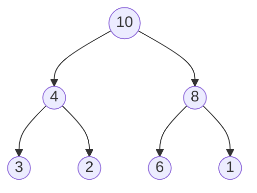

Sorting: Bubble sort; Insertion sort; quick sort; merge; heap sort.

# Sorting Algorithms

Given a messy array, make it unmessy by _sorting_. Ascending, descending, alphabetical, IQ level..

## Quick Reference

| Algorithm      | Time (Avg) | Time (Worst) | Space    | Stable |
| -------------- | ---------- | ------------ | -------- | ------ |
| Bubble Sort    | O(n²)      | O(n²)        | O(1)     | Yes    |
| Insertion Sort | O(n²)      | O(n²)        | O(1)     | Yes    |
| Quick Sort     | O(n log n) | O(n²)        | O(log n) | No     |
| Merge Sort     | O(n log n) | O(n log n)   | O(n)     | Yes    |
| Heap Sort      | O(n log n) | O(n log n)   | O(1)     | No     |

## Bubble Sort

Repeatedly steps through the list, compares adjacent elements and swaps them if they are in the wrong order.

![[Bubble-Sort.png]]

**Time Complexity**: O(n²)

- **Best Case**: O(n) when array is already sorted
- **Average/Worst Case**: O(n²)

**Advantages**:

- Simple to understand and implement
- Stable sorting algorithm
- Requires only O(1) extra space

**Disadvantages**:

- Very inefficient for large datasets
- Always makes O(n²) comparisons even if array is sorted

```typescript
function bubbleSort(arr: number[]): number[] {
  const n = arr.length;
  for (let i = 0; i < n; i++) {
    for (let j = 0; j < n - i - 1; j++) {
      if (arr[j] > arr[j + 1]) {
        [arr[j], arr[j + 1]] = [arr[j + 1], arr[j]];
      }
    }
  }
  return arr;
}
```

> [!Warning] Warning...
> If I ever see you use bubble sort in production..
>
> ![[Bubble-Sort-In-Prod.png|200]]

## Insertion Sort

Builds the final sorted array one item at a time, by repeatedly inserting a new element into the sorted portion of the array.

So you pick an element, compare it with the elements before it, and insert it in the right position. Then pick the next element and repeat.

![[Insertion-sort.png]]

**Time Complexity**: O(n²)

- **Best Case**: O(n) when array is almost sorted
- **Average/Worst Case**: O(n²)

**Advantages**:

- Efficient for small data sets
- Adaptive: if array is nearly sorted, runs in almost O(n) time
- In-place algorithm
- Stable sort
- Online: can sort as data is being received

**Disadvantages**:

- Inefficient for large datasets
- Requires O(n²) comparisons and shifts

```typescript
function insertionSort(arr: number[]): number[] {
  for (let i = 1; i < arr.length; i++) {
    const key = arr[i];
    let j = i - 1;
    while (j >= 0 && arr[j] > key) {
      arr[j + 1] = arr[j];
      j--;
    }
    arr[j + 1] = key;
  }
  return arr;
}
```

## Quick Sort

Uses a divide-and-conquer strategy. Picks a 'pivot' element and partitions the array around it. Then moves the pivot to the middle.
The left side of the pivot is less than the pivot, and the right side is greater than the pivot. This process is repeated recursively for the left and right subarrays.

![[Quick-sort.png]]

**Time Complexity**: O(n log n) average

- **Best Case**: O(n log n)
- **Average Case**: O(n log n)
- **Worst Case**: O(n²) when poorly pivoted

**Advantages**:

- Fastest sorting algorithm in practice
- In-place sorting
- Cache friendly
- Can be easily parallelized (each partition can be sorted in parallel)
- Low overhead

**Disadvantages**:

- Unstable sort
- O(n²) worst case
- Not adaptive

```typescript
function quickSort(arr: number[]): number[] {
  if (arr.length <= 1) return arr;

  const pivot = arr[Math.floor(arr.length / 2)];
  const left = arr.filter((x) => x < pivot);
  const middle = arr.filter((x) => x === pivot);
  const right = arr.filter((x) => x > pivot);

  return [...quickSort(left), ...middle, ...quickSort(right)];
}
```

## Merge Sort

Divides the array into smaller subarrays, sorts them, and then merges them back together.

![[Merge-sort.png]]

**Time Complexity**: O(n log n)

- **Best/Average/Worst Case**: Always O(n log n)

**Advantages**:

- Predictable performance: always O(n log n)
- Stable sort
- Parallelizable
- Great for linked lists - no random access needed

**Disadvantages**:

- Requires O(n) extra space
- Not in-place
- Not adaptive
- Overkill for small arrays

```typescript
function mergeSort(arr: number[]): number[] {
  if (arr.length <= 1) return arr;

  const mid = Math.floor(arr.length / 2);
  const left = mergeSort(arr.slice(0, mid));
  const right = mergeSort(arr.slice(mid));

  return merge(left, right);
}

function merge(left: number[], right: number[]): number[] {
  const result: number[] = [];
  let i = 0,
    j = 0;

  while (i < left.length && j < right.length) {
    if (left[i] <= right[j]) {
      result.push(left[i++]);
    } else {
      result.push(right[j++]);
    }
  }

  return [...result, ...left.slice(i), ...right.slice(j)];
}
```

## Heap Sort

Uses a heap tree data structure to sort elements.

For more info about heaps: [[20 - Trees and graphs#Heaps]]

**Time Complexity**: O(n log n)

- **Best/Average/Worst Case**: Always O(n log n)

**Advantages**:

- In-place sorting
- No extra space needed
- Predictable performance
- Great for finding k largest/smallest elements

**Disadvantages**:

- Unstable sort
- Not adaptive
- Slower in practice than Quick Sort
- Poor cache performance



```typescript
function heapSort(arr: number[]): number[] {
  // Build max heap
  for (let i = Math.floor(arr.length / 2) - 1; i >= 0; i--) {
    heapify(arr, arr.length, i);
  }

  // Extract elements from heap one by one
  for (let i = arr.length - 1; i > 0; i--) {
    [arr[0], arr[i]] = [arr[i], arr[0]];
    heapify(arr, i, 0);
  }

  return arr;
}
```

---

> [!note] Stable vs Unstable Sort
> A sorting algorithm is stable if it preserves the relative order of equal elements. meaning that if two elements are equal, their order in the sorted array will be the same as in the original array.
> For example: let's say we have the following:
>
> ```ts
> const arr = [
>   { IQ: 60, name: "Mahdi" },
>   { IQ: 130, name: "Asmaa" },
>   { IQ: 130, name: "Taleb" },
>   { IQ: 90, name: "Abdo" }
> ];
> ```
>
> If we sort this array by IQ, a stable sort would keep "Asmaa" before "Taleb" in the sorted array. While an unstable sort could change their order.
>
> - Stable: Bubble Sort, Insertion Sort, Merge Sort
> - Unstable: Quick Sort, Heap Sort

> [!note] in-place vs out-of-place
> An in-place sorting algorithm sorts the array without using any extra space. It only uses a constant amount of extra space for variables.
> An out-of-place sorting algorithm creates a new array to store the sorted elements.
>
> - In-place: Quick Sort, Heap Sort, Insertion Sort
> - Out-of-place: Merge Sort

> [!note] Adaptive vs non-adaptive
> An adaptive sorting algorithm takes advantage of existing order in the array. It runs faster if the array is already partially sorted.
> An example of an adaptive sorting algorithm is Insertion Sort. If the array is already sorted, it runs in O(n) time.
>
> - Adaptive: Insertion Sort, Bubble Sort
> - Non-adaptive: Quick Sort, Heap Sort, Merge Sort
