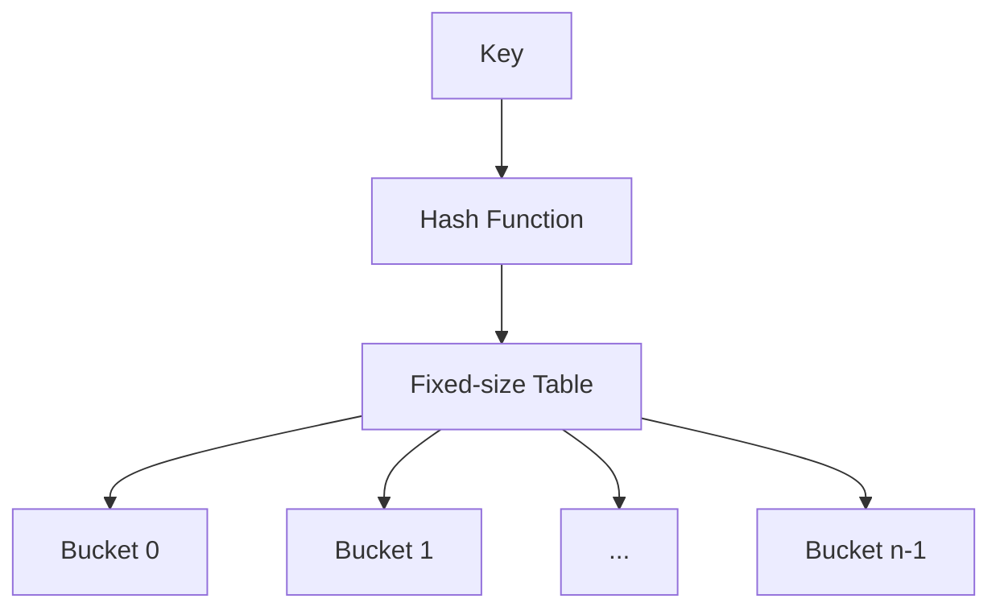
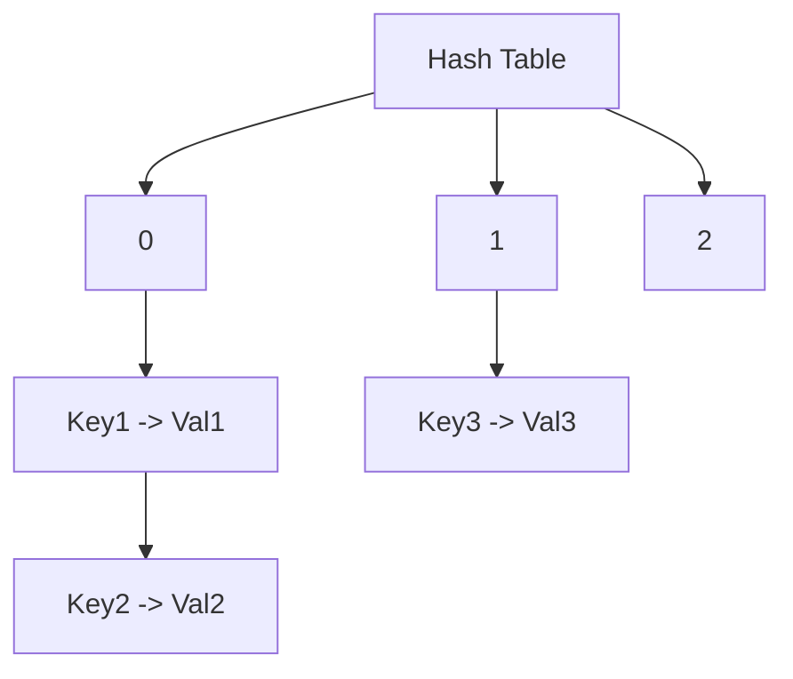

Hashing: Symbol tables; static hashing; dynamic hashing, and collision resolution techniques.

## Hashing

Hashing is a technique used to map data of arbitrary size to fixed-size values. Think of it as a way to create an "index" for your data.

We use this all the time, think dictionaries in javascript, or a map in python.

```ts
const IQ = {
  Mahdi: 60,
  Asmaa: 130,
  Taleb: 130,
  Abdo: 90
};
```

Notice how fast it is to access the IQ of "Mahdi" using `IQ["Mahdi"]`? That's the power of hash tables.

> [!Question] We even use nested tables all the time, what do you think JSON is?
> It's a nested hash table.

> ```ts
> const IQ = {
>   Mahdi: {
>     IQ: 60,
>     age: 20
>   },
>   Asmaa: {
>     IQ: 130,
>     age: 25
>   },
>   Taleb: {
>     IQ: 130,
>     age: 30
>   },
>   Abdo: {
>     IQ: 90,
>     age: 35
>   }
> };
> ```

## Symbol Tables (Hash Tables)

A symbol table is an abstract data type that stores key-value pairs, where each key appears at most once.

```typescript
type HashTable<K, V> = {
  [key: K]: V;
};

// Example:
const phoneBook: HashTable<string, string> = {
  John: "123-456-7890",
  Jane: "098-765-4321"
};
```

### Basic Operations

```typescript
class HashTable<K, V> {
  private table: Array<Array<[K, V]>>;
  private size: number;

  constructor(size: number = 16) {
    this.table = new Array(size).fill(null).map(() => []);
    this.size = size;
  }

  private hash(key: K): number {
    const str = String(key);
    let hash = 0;
    for (let i = 0; i < str.length; i++) {
      hash = (hash << 5) - hash + str.charCodeAt(i);
      hash = hash & hash; // Convert to 32-bit integer
    }
    return Math.abs(hash % this.size);
  }

  set(key: K, value: V): void {
    const index = this.hash(key);
    const bucket = this.table[index];

    // Check if key already exists
    for (let i = 0; i < bucket.length; i++) {
      if (bucket[i][0] === key) {
        bucket[i][1] = value;
        return;
      }
    }

    // Add new key-value pair
    bucket.push([key, value]);
  }

  get(key: K): V | undefined {
    const index = this.hash(key);
    const bucket = this.table[index];

    for (const [k, v] of bucket) {
      if (k === key) return v;
    }

    return undefined;
  }
}
```

## Static Hashing

In static hashing, the hash table size remains constant and is determined at creation time.



### Advantages

- Simple implementation
- Constant-time operations (average case)

### Disadvantages

- Fixed size might lead to poor performance if too many elements
- Waste of space if too few elements

## Dynamic Hashing

Dynamic hashing allows the hash table to grow or shrink based on the number of elements.

```typescript
class DynamicHashTable<K, V> extends HashTable<K, V> {
  private count: number = 0;
  private loadFactorThreshold: number = 0.75;

  private resize(newSize: number): void {
    const oldTable = this.table;
    this.table = new Array(newSize).fill(null).map(() => []);
    this.size = newSize;

    // Rehash all existing entries
    for (const bucket of oldTable) {
      for (const [key, value] of bucket) {
        this.set(key, value);
      }
    }
  }

  set(key: K, value: V): void {
    super.set(key, value);
    this.count++;

    if (this.count / this.size > this.loadFactorThreshold) {
      this.resize(this.size * 2);
    }
  }
}
```

## Collision Resolution

When two keys hash to the same index, we have a collision. Here are common resolution techniques:

### 1. Chaining (Using Linked Lists)



```typescript
class ChainedHashTable<K, V> {
  table: Array<Array<[K, V]>>;

  set(key: K, value: V): void {
    const index = this.hash(key);
    // Simply append to the chain
    this.table[index].push([key, value]);
  }
}
```

### 2. Linear Probing

If a collision occurs, try the next slot until an empty one is found.

```typescript
class LinearProbingHashTable<K, V> {
  table: Array<[K, V] | null>;

  set(key: K, value: V): void {
    let index = this.hash(key);

    while (this.table[index] !== null) {
      index = (index + 1) % this.size;
    }

    this.table[index] = [key, value];
  }
}
```

### 3. Quadratic Probing

Similar to linear probing but tries slots at quadratic intervals.

```typescript
class QuadraticProbingHashTable<K, V> {
  set(key: K, value: V): void {
    let index = this.hash(key);
    let i = 0;

    while (this.table[index] !== null) {
      i++;
      index = (this.hash(key) + i * i) % this.size;
    }

    this.table[index] = [key, value];
  }
}
```

### 4. Double Hashing

Uses a second hash function to determine the probe interval.

```typescript
class DoubleHashTable<K, V> {
  private hash2(key: K): number {
    // Second hash function
    return 7 - (this.hash(key) % 7);
  }

  set(key: K, value: V): void {
    let index = this.hash(key);
    const step = this.hash2(key);

    while (this.table[index] !== null) {
      index = (index + step) % this.size;
    }

    this.table[index] = [key, value];
  }
}
```

## Performance Comparison

| Method            | Average Case | Worst Case | Space    |
| ----------------- | ------------ | ---------- | -------- |
| Chaining          | O(1 + α)     | O(n)       | O(n + m) |
| Linear Probing    | O(1/(1-α))   | O(n)       | O(n)     |
| Quadratic Probing | O(1/(1-α))   | O(n)       | O(n)     |
| Double Hashing    | O(1/(1-α))   | O(n)       | O(n)     |

Where:

- α = load factor (n/m)
- n = number of elements
- m = table size

> [!note] Load Factor
> The load factor α = n/m determines how full the hash table is. A higher load factor means more collisions but better space utilization. Most implementations keep α < 0.75.
