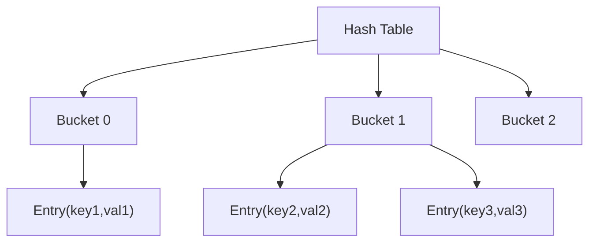
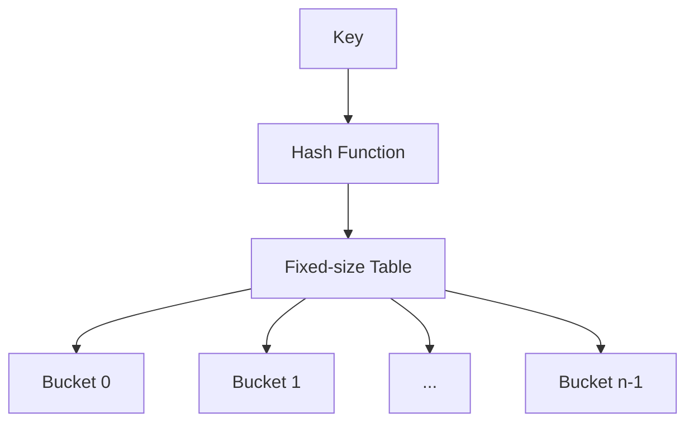
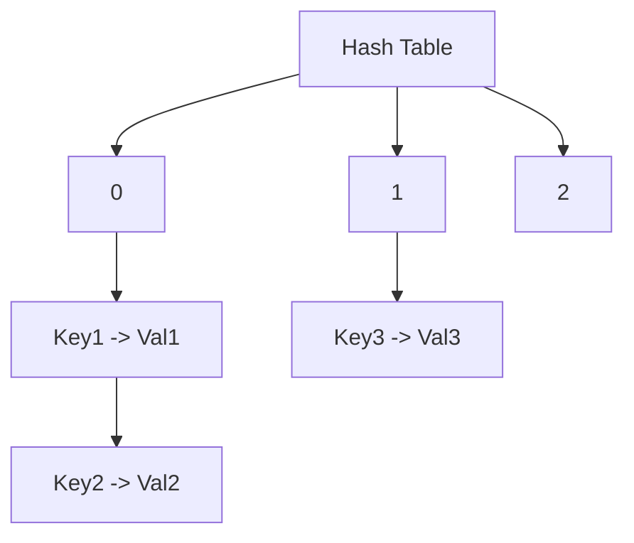
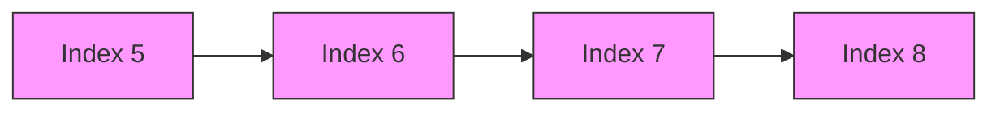

Hashing: Symbol tables; static hashing; dynamic hashing, and collision resolution techniques.

## Hashing

Hashing is a technique used to map data of arbitrary size to fixed-size values. Think of it as a way to create an "index" for your data.

This is super useful for fast data retrieval, like when you want to find a specific item in a large dataset.
Hashing is used in various applications, including:

- **Databases**: For indexing and quick lookups.
- **Cryptography**: For data integrity and security. (e.g., hashing passwords).
- **Caching**: To store frequently accessed data.
- **Data Structures**: Like hash tables, which allow for efficient data retrieval.

## Symbol Tables (Hash Tables)

A symbol table, or _hash-table_, is an abstract data type that stores key-value pairs, where each key appears at most once.

In simple terms, it allows for very fast insertion and searching of items. So no matter how many data items there are, insertion and searching (and sometimes deletion) can take close to constant time _O(1)_.

We use this all the time, think dictionaries in javascript, or a map in python.

```ts
const IQ = {
  Mahdi: 60,
  Asmaa: 130,
  Taleb: 130,
  Abdo: 90
};
```

Ever noticed how fast it is to access the IQ of "Mahdi" using `IQ["Mahdi"]`? That's the power of hash tables.

> [!Question]- We even use nested tables all the time, what do you think `JSON` is?
> It's a nested hash table.
>
> ```ts
> const IQ = {
>   Mahdi: {
>     IQ: 60,
>     age: 25
>   },
>   Asmaa: {
>     IQ: 130,
>     age: 8
>   },
>   Taleb: {
>     IQ: 130,
>     age: 13
>   },
>   Abdo: {
>     IQ: 90,
>     age: 49
>   }
> };
> ```

 I've never heard anyone call it a symbol table before, but here we are.

```typescript
type HashTable<K, V> = {
  [key: K]: V;
};

// Example:
const phoneBook: HashTable<string, string> = {
  sudo_kw: "+965 41000798",
  urmom: "+965 1809777"
};
```

### Disadvantages of Hash-tables:
- They're based on arrays, and arrays are difficult to expand once they are created.
- No easy way to traverse the items! Have to traverse the entire table.
- Always unsorted, expensive to do getMin, getMax, etc.


> [!Warning]
> I don't think the code implementation of hash-tables is required, but you can take a look at it here:
> [[Hash-Table & Dynamic Hash-Table implementation#Hash-Table]]

> [!Important] Fun fact..
> Want to test out how fast hash-tables are? try misspelling a word. You see that red squiggly line? it appeared instantly, but your device had to search through thousands of words saved in a hash-table.

## Hash Table Fundamentals

1. **Hash Function**

A hash function maps data of arbitrary size to fixed-size values. It is what maps key values to positions and is often donated by `h`.

A good hash function should:

    1. Be deterministic (same input = same output)
    2. Distribute values uniformly
    3. Be fast to compute
    4. Minimize collisions

Here is a simple hashing function. Assume a table with 20 slots and a hashing function of `h(k) = k % 10` and `k = sum of numeric values of letters`.

For the following strings:

- "mahdi" = 13 + 1 + 8 + 4 + 9 = 35 Hashcode = 5
- "asmaa" = 1 + 19 + 13 + 1 + 1 = 35; Hashcode = 5
- "taleb" = 20 + 1 + 12 + 5 + 2 = 40; Hashcode = 0
- "abdo" = 1 + 2 + 4 + 15 = 22; Hashcode = 2

The table would look like this:

| Index | Key   |
|-------|-------|
| 0     | taleb |
| 1     | empty |
| 2     | abdo  |
| 3     | empty |
| 4     | empty |
| 5     | mahdi |
| 6     | asmaa |
| 7     | empty |
| 8     | empty |
| 9     | empty |

> [!Note] 
> Notice how 2 values, `mahdi` and `asmaa` had the same hash? This is called a *collision*, and the *collision resolution* technique to use the next available slot (like how we used index 6 above) is called *Linear Probing*. 
> A more detailed explanation of collisions is provided below.


2. **Hash-Table:** The _array_ that holds the records. Denoted by HT.

3. The position in a hash table is also known as a **slot**.

4. **Collisions**: Two hash tables elements map into the same slot in the array (They have the same hash).

5.  **Buckets**

A bucket is a slot in the hash table that can store one or more key-value pairs:

- In open addressing: each bucket holds one item 
- In chaining: each bucket is a linked list of items




## Static Hashing

In static hashing, the hash table size remains constant and is determined at creation time.



### Advantages

- Simple implementation
- Constant-time operations O(1) (average case)

### Disadvantages

- Fixed size might lead to poor performance if too many elements
- Waste of space if too few elements

## Dynamic Hashing

Unlike static hashing, dynamic hashing adapts its structure as elements are added/removed.

### Advantages:

- Better space utilization
- Maintains good performance as data grows
- Adapts to workload

### Disadvantages

- Resizing operation is expensive (O(n))
- More complex implementation
- Memory usage can spike during resizing

## Collision Resolution

When two keys hash to the same index, we have a collision. Here are common resolution techniques:

### 1. Chaining (Using Linked Lists)



```typescript
class ChainedHashTable<K, V> {
  table: Array<Array<[K, V]>>;

  set(key: K, value: V): void {
    const index = this.hash(key);
    // Simply append to the chain
    this.table[index].push([key, value]);
  }
}
```

### 2. Linear Probing

If a collision occurs, try the next slot until an empty one is found.

```typescript
class LinearProbingHashTable<K, V> {
  table: Array<[K, V] | null>;

  set(key: K, value: V): void {
    let index = this.hash(key);

    while (this.table[index] !== null) {
      index = (index + 1) % this.size;
    }

    this.table[index] = [key, value];
  }
}
```

### 3. Quadratic Probing

Similar to linear probing but tries slots at quadratic intervals.

```typescript
class QuadraticProbingHashTable<K, V> {
  set(key: K, value: V): void {
    let index = this.hash(key);
    let i = 0;

    while (this.table[index] !== null) {
      i++;
      index = (this.hash(key) + i * i) % this.size;
    }

    this.table[index] = [key, value];
  }
}
```

### 4. Double Hashing

Uses a second hash function to determine the probe interval.

```typescript
class DoubleHashTable<K, V> {
  private hash2(key: K): number {
    // Second hash function
    return 7 - (this.hash(key) % 7);
  }

  set(key: K, value: V): void {
    let index = this.hash(key);
    const step = this.hash2(key);

    while (this.table[index] !== null) {
      index = (index + step) % this.size;
    }

    this.table[index] = [key, value];
  }
}
```

## Performance Comparison

| Method            | Average Case | Worst Case | Space    |
| ----------------- | ------------ | ---------- | -------- |
| Chaining          | O(1 + α)     | O(n)       | O(n + m) |
| Linear Probing    | O(1/(1-α))   | O(n)       | O(n)     |
| Quadratic Probing | O(1/(1-α))   | O(n)       | O(n)     |
| Double Hashing    | O(1/(1-α))   | O(n)       | O(n)     |

Where:

- α = load factor (n/m)
- n = number of elements
- m = table size

> [!note] Load Factor
> The load factor α = n/m determines how full the hash table is. A higher load factor means more collisions but better space utilization. Most implementations keep α < 0.75.

### Problems with Different Resolution Methods:

#### 1. Chaining

**Advantages:**

- Simple to implement
- Performs well with good hash function
- No space waste

**Disadvantages:**

- Extra memory for linked list nodes
- Poor cache performance
- Linked list operations overhead

#### 2. Linear Probing

**Advantages:**

- Better cache performance
- Simple implementation
- No extra data structures

**Disadvantages:**

- Primary clustering: consecutive occupied slots form clusters
- Performance degrades as table fills up
- Deletion requires special handling



#### 3. Quadratic Probing

**Advantages:**

- Eliminates primary clustering
- Better distribution than linear probing

**Disadvantages:**

- Secondary clustering: items with same initial position probe same locations
- May not find empty slot even when one exists
- More complex than linear probing

#### 4. Double Hashing

**Advantages:**

- No clustering
- Better distribution than linear/quadratic probing

**Disadvantages:**

- Requires second hash function
- More expensive computation
- Complex implementation

> [!tip] Choosing a Resolution Method
>
> - Use **Chaining** when:
>   - Load factor might exceed 0.7
>   - Delete operations are frequent
> - Use **Linear Probing** when:
>   - Cache performance is critical
>   - Load factor stays below 0.7
> - Use **Double Hashing** when:
>   - Maximum performance is needed
>   - Space is at a premium
