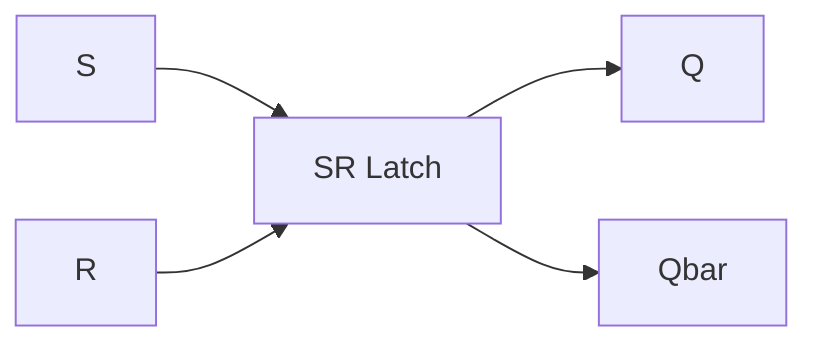
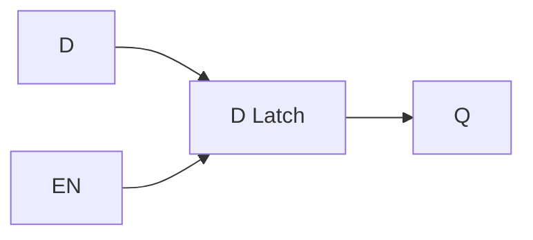

Flip flops (SR, D, T, Master-Slave, JK, latches and edge triggered), Registers, counters (synchronous, and asynchronous) and the Verilog coding.

These are all sequential circuits that store and process binary information. Unlike combinational circuits, these have memory - their outputs depend on both current inputs and previous state.

> [!Note] tl;dr:
> Combinational: output = f(input)
> Sequential: output = f(input, previous_output)
> So sequential has memory of the past

![[Memory-symbol.png]]

## Basic Latches

Latches are basic memory elements that can store one bit of information.

### SR Latch (Set-Reset)

The most basic memory element. Has two inputs:

- S (Set): Sets output to 1
- R (Reset): Sets output to 0

So you set, and it stores that "active" state, you reset, and it stores that "inactive" state. When either go to 0, it stays in the last state.

- Q: Output
- Qbar: Inverted output



Truth Table:

| S   | R   | Q   | Q'  | Comment   |
| --- | --- | --- | --- | --------- |
| 0   | 0   | Q   | Q   | No change |
| 0   | 1   | 0   | 1   | Reset     |
| 1   | 0   | 1   | 0   | Set       |
| 1   | 1   | x   | x   | Invalid   |

```verilog
module sr_latch(
    input S, R,
    output reg Q, Qbar
);
    always @(S or R) begin
        if (S && !R) begin
            Q <= 1;
            Qbar <= 0;
        end else if (!S && R) begin
            Q <= 0;
            Qbar <= 1;
        end
        // S=R=1 is invalid state
        // S=R=0 maintains previous state
    end
endmodule
```

### D Latch

Improved version of SR latch that prevents invalid states. Has:

- D (Data): Input data
- EN (Enable): Controls when latch updates



Truth Table:

| EN  | D   | Q   | Comment   |
| --- | --- | --- | --------- |
| 0   | x   | Q   | No change |
| 1   | 0   | 0   | Load 0    |
| 1   | 1   | 1   | Load 1    |

```verilog
module d_latch(
    input D, EN,
    output reg Q
);
    always @(D or EN) begin
        if (EN)
            Q <= D;
    end
endmodule
```

## Flip-Flops

### D Flip-Flop

Similar to D latch but changes state only on clock edge.

```verilog
module d_flipflop(
    input D, CLK,
    output reg Q
);
    always @(posedge CLK) begin
        Q <= D;
    end
endmodule
```

### T Flip-Flop (Toggle)

Toggles output when T=1, maintains state when T=0.

```verilog
module t_flipflop(
    input T, CLK,
    output reg Q
);
    always @(posedge CLK) begin
        if (T)
            Q <= ~Q;
    end
endmodule
```

### JK Flip-Flop

Combines features of SR and T flip-flops. Most versatile.

Truth Table:
| J | K | Q(next) | Comment |
|---|---|---------|---------|
| 0 | 0 | Q | No change |
| 0 | 1 | 0 | Reset |
| 1 | 0 | 1 | Set |
| 1 | 1 | ~Q | Toggle |

```verilog
module jk_flipflop(
    input J, K, CLK,
    output reg Q
);
    always @(posedge CLK) begin
        case ({J,K})
            2'b00: Q <= Q;    // No change
            2'b01: Q <= 0;    // Reset
            2'b10: Q <= 1;    // Set
            2'b11: Q <= ~Q;   // Toggle
        endcase
    end
endmodule
```

## Registers

A register is a group of flip-flops that store multiple bits.

### Basic Register

```verilog
module register #(
    parameter WIDTH = 8
)(
    input [WIDTH-1:0] D,
    input CLK, RESET,
    output reg [WIDTH-1:0] Q
);
    always @(posedge CLK or posedge RESET) begin
        if (RESET)
            Q <= 0;
        else
            Q <= D;
    end
endmodule
```

### Shift Register

Can shift bits left or right.

```verilog
module shift_register #(
    parameter WIDTH = 8
)(
    input CLK, RESET,
    input SHIFT_RIGHT, // 1 for right, 0 for left
    input IN_BIT,     // New bit to shift in
    output reg [WIDTH-1:0] Q
);
    always @(posedge CLK or posedge RESET) begin
        if (RESET)
            Q <= 0;
        else if (SHIFT_RIGHT)
            Q <= {IN_BIT, Q[WIDTH-1:1]}; // Right shift
        else
            Q <= {Q[WIDTH-2:0], IN_BIT}; // Left shift
    end
endmodule
```

## Counters

### Asynchronous Counter

Each flip-flop triggers the next one. Simple but can have glitches.

```verilog
module async_counter #(
    parameter WIDTH = 4
)(
    input CLK, RESET,
    output reg [WIDTH-1:0] COUNT
);
    always @(posedge CLK or posedge RESET) begin
        if (RESET)
            COUNT <= 0;
        else
            COUNT <= COUNT + 1;
    end
endmodule
```

### Synchronous Counter

All flip-flops change state together on clock edge. More reliable.

```verilog
module sync_counter #(
    parameter WIDTH = 4,
    parameter MAX_COUNT = 9  // For decade counter
)(
    input CLK, RESET,
    output reg [WIDTH-1:0] COUNT
);
    always @(posedge CLK or posedge RESET) begin
        if (RESET)
            COUNT <= 0;
        else if (COUNT == MAX_COUNT)
            COUNT <= 0;
        else
            COUNT <= COUNT + 1;
    end
endmodule
```

### Up-Down Counter

Can count in both directions.

```verilog
module updown_counter #(
    parameter WIDTH = 4
)(
    input CLK, RESET,
    input UP_DOWN, // 1 for up, 0 for down
    output reg [WIDTH-1:0] COUNT
);
    always @(posedge CLK or posedge RESET) begin
        if (RESET)
            COUNT <= 0;
        else if (UP_DOWN)
            COUNT <= COUNT + 1;
        else
            COUNT <= COUNT - 1;
    end
endmodule
```

> [!tip] Clock Edge Types
>
> - **Positive Edge (posedge)**: Triggers when clock goes from 0 to 1
> - **Negative Edge (negedge)**: Triggers when clock goes from 1 to 0
> - Most modern systems use positive edge triggering
