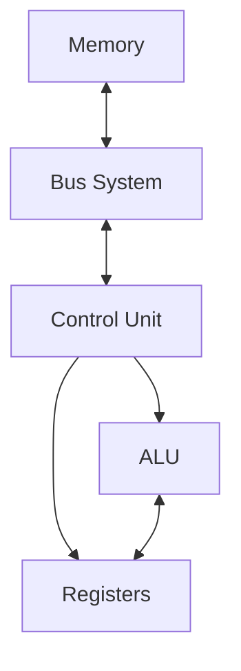
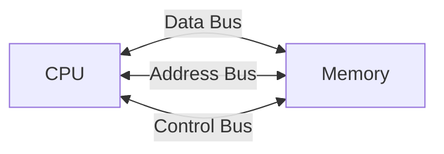

Architecture, Registers and Instructions.

General notes.

## Basic Architecture

![[Architecture.png]]

A microprocessor is a programmable device that processes data according to instructions stored in memory. The main components are:

1. **ALU (Arithmetic Logic Unit)**

   - Performs arithmetic operations
   - Executes logical operations
   - Core computational unit
     example: ADD, SUB, AND, OR
   - Can perform bitwise operations
     example: AND, OR, NOT, XOR

2. **Control Unit**

   - Fetches instructions
   - Decodes instructions
   - Executes instructions
   - Controls data flow

3. **Registers**

   - Small, fast storage locations
   - Hold data being processed
   - Store intermediate results

4. **Buses**
   - Data Bus: Transfers data
   - Address Bus: Specifies memory locations
   - Control Bus: Carries control signals



## CISC vs RISC

Two main philosophies in processor design:

| Feature                | CISC                               | RISC                                |
| ---------------------- | ---------------------------------- | ----------------------------------- |
| **Definition**         | Complex Instruction Set Computer   | Reduced Instruction Set Computer    |
| **Instruction Set**    | Large and complex                  | Small and simple                    |
| **Instruction Length** | Variable length                    | Fixed length                        |
| **Addressing Modes**   | Many addressing modes              | Few addressing modes                |
| **Clock Cycles**       | Multiple cycles per instruction    | Usually 1 cycle per instruction     |
| **Hardware**           | Complex hardware, simpler software | Simple hardware, more compiler work |
| **Examples**           | x86, x64                           | ARM, RISC-V, 8051                   |

### Example: Move Operation

**CISC (x86):**

```assembly
MOV AX, [BX + SI + 4000h]  ; Complex addressing mode
```

- One instruction but multiple cycles
- Can directly access memory

**RISC (ARM):**

```assembly
LDR R0, [R1, #4]  ; Load from memory
MOV R2, R0        ; Move between registers
```

- Multiple simple instructions
- Load-Store architecture

## Basic Components

### Registers

Fast storage locations within the CPU:

- General Purpose Registers (R0-R7, AX, BX, etc.)
- Special Purpose Registers (PC, SP, etc.)
- Status Registers (Flags)

> [!Important]- Fun fact: RAM uses registers to give data instantly, given the address it will directly access the data in the register (using a bunch of MUXes/Logic gates). This is why registers are so fast.
> Things such as HDDs and SSDs are slower because they have to access the data from a physical location. In case of an HDD, it has to spin the disk until it finds the data!
> It's called "Random Access Memory" (RAM) because it can access any random location in memory instantly, while ROM (Read-Only Memory) has to traverse the memory to find the data.
> Here is an interesting video of this usage:
> [https://www.youtube.com/watch?v=HGkuRp5HfH8](https://www.youtube.com/watch?v=HGkuRp5HfH8)

### RAM & ROM

In the context of microprocessors, RAM and ROM are types of memory which are used to store data and instructions.

- **RAM (Random Access Memory)**: Volatile, temporary storage for data and instructions
- **ROM (Read-Only Memory)**: Non-volatile, permanent storage for firmware and system instructions

ROM stores instructions of the system (the code you write) and RAM stores the data (the variables you use, addresses, etc..)

### Instruction Set

The vocabulary of the processor:

```
Arithmetic: ADD, SUB, MUL, DIV
Logic: AND, OR, NOT, XOR
Data Movement: MOV, LOAD, STORE
Control: JUMP, BRANCH, CALL
```

Example of an instruction:

```assembly
LABEL:  ; Label for jump
MOV R0, R1  ; Move value from R1 to R0
ADD R0, R2  ; Add value in R2 to R0
SUB R0, #5   ; Subtract 5 from R0
JUMP LABEL   ; Jump to LABEL
```

### Memory Interface

- Address decoding
- Read/Write control
- Memory mapped I/O

### Bus Structure



> [!note] Von Neumann vs Harvard
>
> - **Von Neumann**: Single memory for both data and instructions
> - **Harvard**: Separate memories for data and instructions
>   Most modern processors use Modified Harvard architecture (separate caches but shared main memory)
