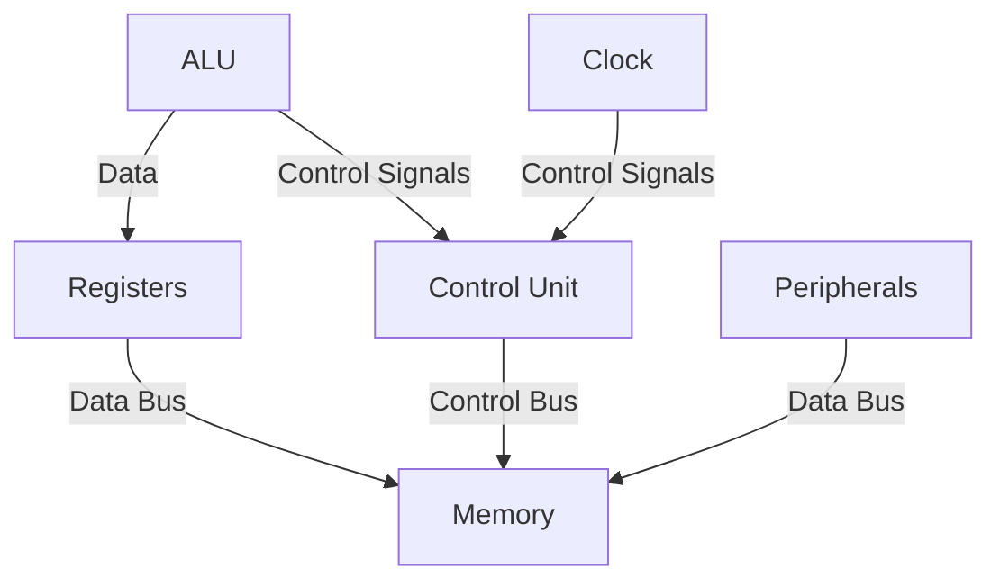
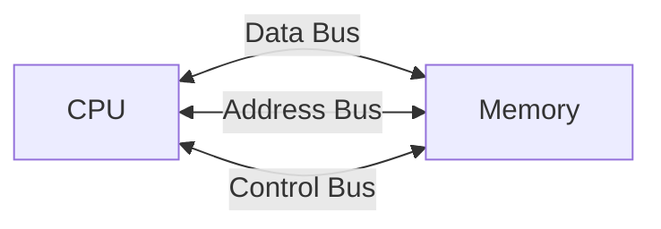

Architecture, Registers and Instructions.

General notes.

## Basic Architecture

![[Architecture.png]]

A microprocessor is a programmable device that processes data according to instructions stored in memory. The main components are:

1. **ALU (Arithmetic Logic Unit)**

   - Performs arithmetic operations
   - Executes logical operations
   - Core computational unit
     example: ADD, SUB, AND, OR
   - Can perform bitwise operations
     example: AND, OR, NOT, XOR

2. **Control Unit**

   - Fetches instructions
   - Decodes instructions
   - Executes instructions
   - Controls data flow

3. **Registers**

   - Small, fast storage locations
   - Hold data being processed
   - Store intermediate results

4. **Buses**

   - Data Bus: Transfers data
   - Address Bus: Specifies memory locations
   - Control Bus: Carries control signals

5. **Peripherals**:

   - timers for timing/counting
   - UART for serial communication
   - Other Input/Outputs.. whatever you can connect to the CPU

6. **Timing and Control Unit**:

   - Generates control signals
   - Synchronizes operations with clock
   - Manages instruction execution

7. **Oscillator**:
   - Internal clock generator
   - Uses external crystal
   - All operations synchronized to this clock



## CISC vs RISC

Two main philosophies in processor design:

| Feature                | CISC                               | RISC                                |
| ---------------------- | ---------------------------------- | ----------------------------------- |
| **Definition**         | Complex Instruction Set Computer   | Reduced Instruction Set Computer    |
| **Instruction Set**    | Large and complex                  | Small and simple                    |
| **Instruction Length** | Variable length                    | Fixed length                        |
| **Addressing Modes**   | Many addressing modes              | Few addressing modes                |
| **Clock Cycles**       | Multiple cycles per instruction    | Usually 1 cycle per instruction     |
| **Hardware**           | Complex hardware, simpler software | Simple hardware, more compiler work |
| **Examples**           | x86, x64                           | ARM, RISC-V, 8051                   |

### Example: Move Operation

**CISC (x86):**

```assembly
MOV AX, [BX + SI + 4000h]  ; Complex addressing mode
```

- One instruction but multiple cycles
- Can directly access memory

**RISC (ARM):**

```assembly
LDR R0, [R1, #4]  ; Load from memory
MOV R2, R0        ; Move between registers
```

- Multiple simple instructions
- Load-Store architecture

## Basic Components

![[Programmer Model.png]]

### Registers

Fast storage locations within the CPU:

- General Purpose Registers (R0-R7, AX, BX, etc.)
- Special Purpose Registers (PC, SP, etc.)
- Status Registers (Flags)

> [!Important]- Fun fact: RAM uses registers to give data instantly, given the address it will directly access the data in the register (using a bunch of MUXes/Logic gates). This is why registers are so fast.
> Things such as HDDs and SSDs are slower because they have to access the data from a physical location. In case of an HDD, it has to spin the disk until it finds the data!
> It's called "Random Access Memory" (RAM) because it can access any random location in memory instantly, while ROM (Read-Only Memory) has to traverse the memory to find the data.
> Here is an interesting video of this usage:
> [https://www.youtube.com/watch?v=HGkuRp5HfH8](https://www.youtube.com/watch?v=HGkuRp5HfH8)

![[Registers.png]]

1. PC (Program Counter): Holds the address of the next instruction to be executed. Automatically increments after each instruction fetch.
2. SP (Stack Pointer): Points to the top of the stack in memory. Data is pushed/popped from the stack using this pointer.
3. DPT (Data Pointer): Used for indirect addressing. Points to data in external memory (RAM) or program memory (ROM). Can be used as 16-bit or 2 8-bit registers (DPH and DPL).
4. A (Accumulator): Used for arithmetic and logic operations. Can be used as a source or destination for data.
5. B: Used alongside A in multiplication and division operations to hold one of the operands (multiplier/multiplicand) and to store high-order bits of the result. Or in division to hold the divisor and store remainder.
6. P1-3 (IO latch registers): Used for input/output operations. Can be used to read/write data to/from external devices. Bit as well as byte addressable.
7. TL0, TH0, TL1, TH1: Timer registers. Used for timer/counter operations. Can be used to set timer intervals or count events.
8. TMOD and TCON: Timer control registers. Used to configure timer modes and control timer operations. TMOD is used to set the mode of operation (timer/counter) and TCON is used to start/stop the timers.
9. IP and IE: Interrupt registers. Used to enable/disable interrupts and set interrupt priorities. IP is used to set the priority of the interrupt sources, while IE is used to enable or disable the interrupts.
10. PSW (Program Status Word): Contains flags that indicate the status of the processor. Flags include Carry, Auxiliary Carry, Parity, Overflow, and Zero flags.


### RAM & ROM

In the context of microprocessors, RAM and ROM are types of memory which are used to store data and instructions.

- **RAM (Random Access Memory)**: Volatile, temporary storage for data and instructions
- **ROM (Read-Only Memory)**: Non-volatile, permanent storage for firmware and system instructions

ROM stores instructions of the system (the code you write) and RAM stores the data (the variables you use, addresses, etc..)

### Instruction Set

The vocabulary of the processor:

```
Arithmetic: ADD, SUB, MUL, DIV
Logic: AND, OR, NOT, XOR
Data Movement: MOV, LOAD, STORE
Control: JUMP, BRANCH, CALL
```

Example of an instruction:

```assembly
LABEL:  ; Label for jump
MOV R0, R1  ; Move value from R1 to R0
ADD R0, R2  ; Add value in R2 to R0
SUB R0, #5   ; Subtract 5 from R0
JUMP LABEL   ; Jump to LABEL
```

### Memory Interface

- Address decoding
- Read/Write control
- Memory mapped I/O

### Bus Structure



> [!note] Von Neumann vs Harvard
>
> - **Von Neumann**: Single memory for both data and instructions
> - **Harvard**: Separate memories for data and instructions
>   Most modern processors use Modified Harvard architecture (separate caches but shared main memory)
