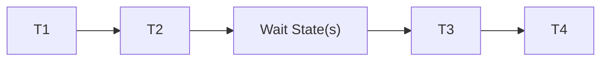
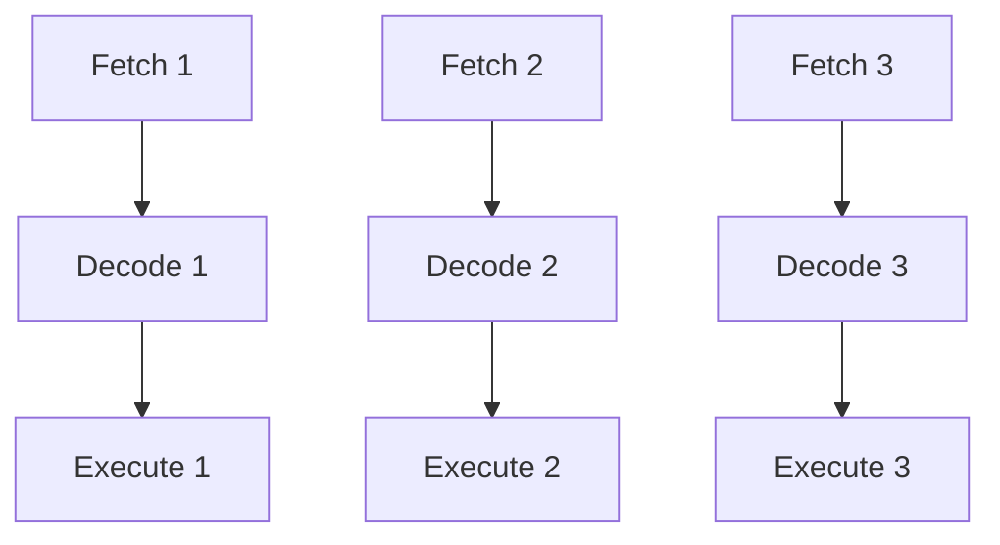

Clocks, Frequency, and Machine Cycles

## Clock Signal

A clock signal is a digital waveform that coordinates actions in digital circuits. It alternates between high (1) and low (0) at a regular interval.


### Clock Characteristics

1. **Frequency**: Number of cycles per second (Hz)
2. **Period**: Time for one complete cycle (T = 1/f)
3. **Duty Cycle**: Ratio of high time to total period
4. **Rise/Fall Time**: Time to transition between states


## Clock Frequency

The speed of a processor is primarily determined by its clock frequency.

- 1 Hz = 1 cycle/second
- 1 MHz = 1,000,000 cycles/second
- 1 GHz = 1,000,000,000 cycles/second

> [!example] Example
> A 4GHz processor performs 4 billion cycles per second.
> Period = 1/4,000,000,000 = 0.25 nanoseconds per cycle

### Factors Affecting Maximum Frequency

1. Propagation Delay
2. Setup/Hold Times
3. Temperature
4. Power Consumption
5. Manufacturing Process

## Machine Cycles

A machine cycle is the time required to complete one basic operation. It consists of multiple clock cycles.

### Basic Machine Cycle Phases

1. **Fetch Cycle**

   - Get instruction from memory
   - Update Program Counter (PC)

   ```mermaid
   graph LR
       A[PC] -->|Address| B[Memory]
       B -->|Instruction| C[IR]
   ```

2. **Decode Cycle**

   - Interpret instruction
   - Determine required operations

3. **Execute Cycle**
   - Perform the operation
   - Store results

> [!note] Important
> Not all instructions take the same number of machine cycles!
> Simple operations might take 1-2 cycles, while complex ones can take many more.

### Example Instruction Timing

```
MOV AX, BX    ; 1 machine cycle
ADD AX, [SI]  ; 2-3 machine cycles (memory access)
MUL CX        ; 3+ machine cycles (complex operation)
```

## Clock States and Wait States

### Clock States

1. **T1**: Address Output
2. **T2**: Data Transfer
3. **T3**: Data Processing
4. **T4**: Result Write-back

### Wait States

Extra clock cycles inserted when:

- Slow memory access needed
- I/O devices need more time
- Bus contention occurs



## Instruction Pipelining

Modern processors use pipelining to execute multiple instructions simultaneously.



### Pipeline Hazards

1. **Data Hazards**: Dependencies between instructions
2. **Control Hazards**: Branch instructions
3. **Structural Hazards**: Resource conflicts

> [!tip] Performance Calculation
> Instructions Per Second = Clock Frequency × Instructions Per Clock Cycle (IPC)
>
> Example: 3GHz CPU with average IPC of 2
> Performance = 3,000,000,000 × 2 = 6 billion instructions/second

## Clock Synchronization

Multiple clock domains require careful synchronization:

1. CPU Clock
2. Bus Clock
3. Memory Clock
4. I/O Clock

### Clock Division and Multiplication

- **Phase-Locked Loop (PLL)**: Generates derived clocks
- **Clock Dividers**: Create slower clocks
- **Clock Multipliers**: Create faster clocks

> [!warning] Critical Timing
> Violations of setup/hold times can cause unpredictable behavior!
