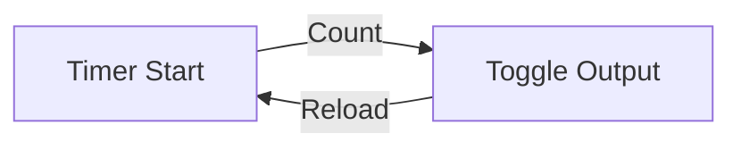
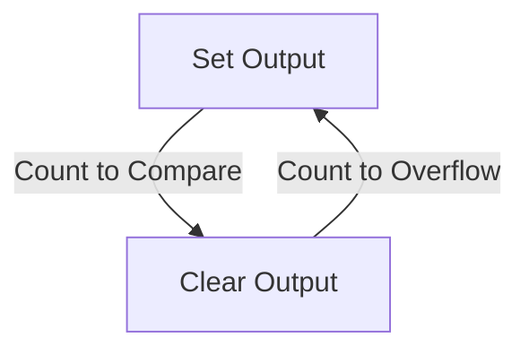

Timer and Counter Concepts

A timer/counter is a register whose content is automatically incremented/decremented by hardware.

- **Timer**: Counts internal clock pulses (time measurement)
- **Counter**: Counts external events (event counting)

## Timer Modes

To configure the timer, we use the TMOD register.

![[TMOD.png]]

- C/T: Counter/Timer select (0 = Timer, 1 = Counter)
- GATE: Timer Gate control (0 = Timer always running, 1 = Timer starts/stops with external signal)

### Mode 0: 13-bit Timer

- TLx: Lower 5 bits
- THx: Upper 8 bits
- Maximum count: 8192 (2¹³)

### Mode 1: 16-bit Timer

- TLx: Lower 8 bits
- THx: Upper 8 bits
- Maximum count: 2¹⁶

### Mode 2: 8-bit Auto-Reload

- TLx: Contains reload value
- THx: Counts and reloads from TLx
- Good for fixed timing intervals

### Mode 3: Split Timer

- Timer 0 splits into two 8-bit timers
- Timer 1 can be used normally

## Timer Calculations

### Basic Time Calculation

```
Time = (MAX_COUNT - INITIAL_VALUE) × Machine_Cycle_Time
```

Example: For 50ms delay with 12MHz crystal:

```
Machine_Cycle = 1μs
Required_Count = 50,000
Initial_Value = 65536 - 50000 = 15536 (3CAFh)
TH0 = 3Ch
TL0 = AFh
```

### Frequency Calculation

```
Timer_Frequency = Clock_Frequency ÷ Prescaler
```

## Programming Examples

### Timer Initialization

```assembly
MOV TMOD, #01H    ; Mode 1, 16-bit timer
MOV TH0, #3CH     ; High byte
MOV TL0, #AFH     ; Low byte
SETB TR0          ; Start timer
```

### Timer Interrupt

```assembly
TIMER0_ISR:
    MOV TH0, #3CH     ; Reload values
    MOV TL0, #AFH
    ; Your code here
    RETI
```

## Timer Applications

### 1. Pulse Generation



### 2. PWM Generation



### 3. Baud Rate Generation

```
Baud_Rate = Timer_Frequency ÷ 16
```

## Counter Operations

### External Event Counting

```assembly
MOV TMOD, #06H    ; Mode 2, Counter
MOV TH0, #00H     ; Initial count
SETB TR0          ; Start counting
```

### Frequency Measurement

```
Input_Frequency = Count × (1 / Measurement_Time)
```

## Common Issues and Solutions

### 1. Timer Overflow

- Use interrupt handling
- Implement software counters

### 2. Timing Accuracy

- Consider crystal accuracy
- Account for interrupt latency
- Use proper prescaler values

### 3. Maximum Time Limits

16-bit timer maximum time at 12MHz:

```
Max_Time = 65536 × (1/1000000)
        = 65.536 ms
```

For longer intervals:

- Use software counters
- Cascade multiple timers
- Use auto-reload mode

> [!tip] Debugging Timer Code
>
> 1. Check prescaler settings
> 2. Verify initial values
> 3. Monitor overflow flags
> 4. Use oscilloscope for verification

## Timer Control Registers

### TMOD (Timer Mode) Register

```
Bit 7: Timer1 Gate
Bit 6: Timer1 C/T
Bit 5-4: Timer1 Mode
Bit 3: Timer0 Gate
Bit 2: Timer0 C/T
Bit 1-0: Timer0 Mode
```

### TCON (Timer Control) Register

```
Bit 7: TF1 (Timer1 Overflow Flag)
Bit 6: TR1 (Timer1 Run Control)
Bit 5: TF0 (Timer0 Overflow Flag)
Bit 4: TR0 (Timer0 Run Control)
```

> [!important] Programming Tips
>
> - Always disable interrupts while configuring timers
> - Clear timer flags before starting
> - Use appropriate prescaler values for desired timing
> - Consider interrupt priorities if using multiple timers
