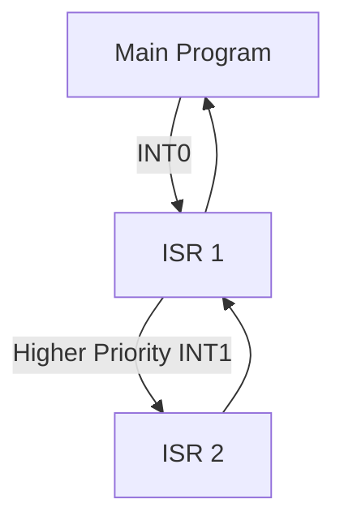

Interrupt System and related topics.

idk what other topics are

Interrupts are signals that cause the processor to temporarily stop its current execution and handle some other task (the interrupt service routine or ISR).

## Interrupt vs polling

- Polling: CPU checks status of devices at regular intervals to see if they need attention.
- Interrupt: Device signals CPU when it needs attention to execute ISR (interrupt service routine).

## Advantages of Interrupts

- Interrupts are more efficient as they allow the CPU to perform other tasks until an event occurs.
- Don't waste CPU time checking status of devices (busy spinning).
- Priority-based handling of multiple interrupts is easily defined.
- Can control which device can interrupt the CPU (masking devices).

## Types of Interrupts

1. **Hardware Interrupts**

   - External events (INT0, INT1)
   - Timer overflow (TF0, TF1)
   - Serial communication (RI, TI)

2. **Software Interrupts**
   - Generated by software instructions
   - Used for system calls

## ISR (Interrupt Service Routine)

- A special function that executes when an interrupt occurs.
- Every ISR is located in a fixed address in memory.
- Addresss are defined in the interrupt vector table.
- When it finishes, it returns RETI (Return from Interrupt) to resume the main program.

## Interrupt Vectors

The 8051 has fixed locations in memory for interrupt service routines:

| Interrupt Source  | Vector Address | Priority |
| ----------------- | -------------- | -------- |
| External 0 (INT0) | 0003H          | Highest  |
| Timer 0 (TF0)     | 000BH          | ↓        |
| External 1 (INT1) | 0013H          | ↓        |
| Timer 1 (TF1)     | 001BH          | Lowest   |

## Interrupt Enable Register (IE)

![[IE-Register.png]]

```
EA  - Enable All (Global enable)
ES  - Enable Serial
ET1 - Enable Timer 1
EX1 - Enable External 1
ET0 - Enable Timer 0
EX0 - Enable External 0
```

Example: Enable Timer 0 interrupt:

```assembly
SETB EA      ; Enable all interrupts
SETB ET0     ; Enable Timer 0 interrupt
```

## Interrupt Priority Register (IP)

![[IP-Register.png]]

```
PT1 - Timer 1 Priority
PX1 - External 1 Priority
PT0 - Timer 0 Priority
PX0 - External 0 Priority
```

Example: Set Timer 0 as high priority:

```assembly
SETB PT0     ; Set Timer 0 as high priority
```

## Interrupt Service Routine (ISR)

```assembly
ORG 000BH        ; Timer 0 interrupt vector
    LJMP Timer0_ISR  ; Jump to ISR

ORG 0030H        ; ISR location
Timer0_ISR:
    ; Save context
    PUSH ACC
    PUSH PSW

    ; ISR code here

    ; Restore context
    POP PSW
    POP ACC
    RETI         ; Return from interrupt
```

## Example: Timer Interrupt

Create a 1-second delay using Timer 0 interrupt:

```assembly
ORG 0000H
    LJMP Main

ORG 000BH            ; Timer 0 vector
    LJMP Timer0_ISR

ORG 0030H
Main:
    MOV TMOD, #01H   ; Timer 0, Mode 1
    MOV TH0, #3CH    ; Initial values for
    MOV TL0, #0B0H   ; 50ms delay
    SETB EA          ; Enable all interrupts
    SETB ET0         ; Enable Timer 0
    SETB TR0         ; Start Timer 0
    SJMP $           ; Wait here

Timer0_ISR:
    MOV TH0, #3CH    ; Reload timer
    MOV TL0, #0B0H

    ; Your code here

    RETI            ; Return from interrupt
```

## Nested Interrupts

Higher priority interrupts can interrupt lower priority ones:



## Important Concepts

1. **Interrupt Latency**

   - Time between interrupt request and ISR execution
   - Affected by:
     - Current instruction completion
     - Context saving
     - Jump to ISR

2. **Context Saving**

   - Must save registers used in ISR
   - Typically: ACC, PSW, etc.
   - Restore before returning

3. **Critical Sections**

   ```assembly
   CLR EA          ; Disable all interrupts
   ; Critical code here
   SETB EA         ; Re-enable interrupts
   ```

4. **Interrupt Flags**
   - Must be cleared in software
   - Example for Timer 0:
   ```assembly
   CLR TF0         ; Clear Timer 0 overflow flag
   ```

## Common Applications

1. **Real-Time Clock**

```assembly
ORG 000BH
Clock_ISR:
    INC Seconds
    MOV A, Seconds
    CJNE A, #60, Exit
    MOV Seconds, #0
    INC Minutes
Exit:
    RETI
```

2. **Debouncing**

```assembly
EX0_ISR:
    ACALL Delay_20ms    ; Wait for bounce
    JB P3.2, Exit       ; Check if still pressed
    ; Button code here
Exit:
    RETI
```

3. **Serial Communication**

```assembly
Serial_ISR:
    JNB RI, Check_TI    ; Check receive
    CLR RI
    MOV A, SBUF         ; Get received byte
    RET
Check_TI:
    JNB TI, Exit        ; Check transmit
    CLR TI
Exit:
    RETI
```

> [!tip] Best Practices
>
> 1. Keep ISRs short
> 2. Always save/restore context
> 3. Clear interrupt flags
> 4. Use priorities wisely
> 5. Avoid disabling interrupts for long periods
