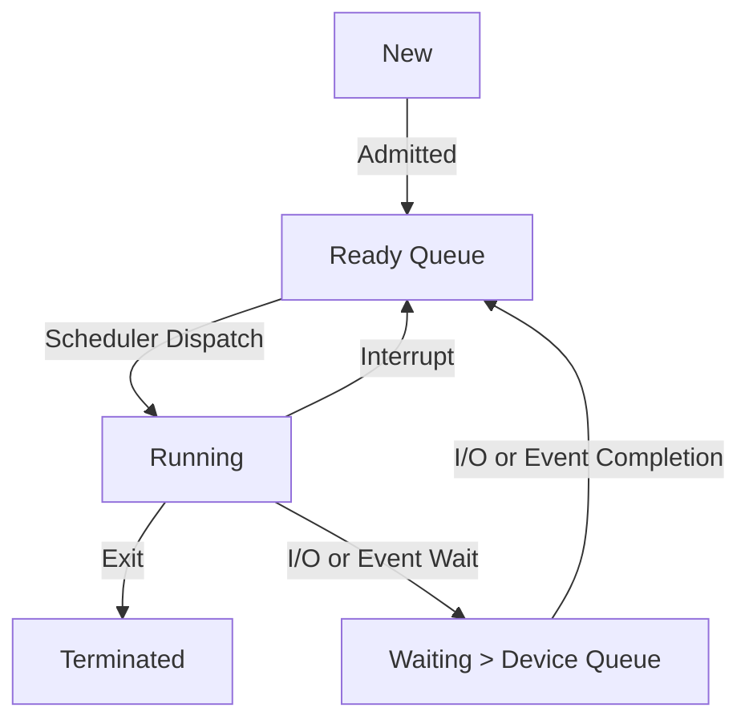
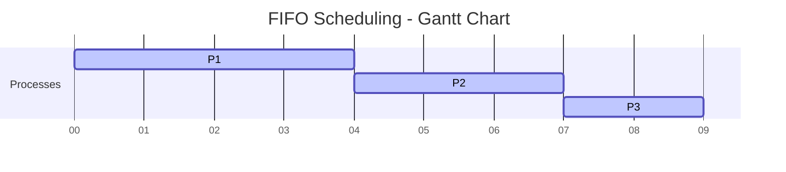
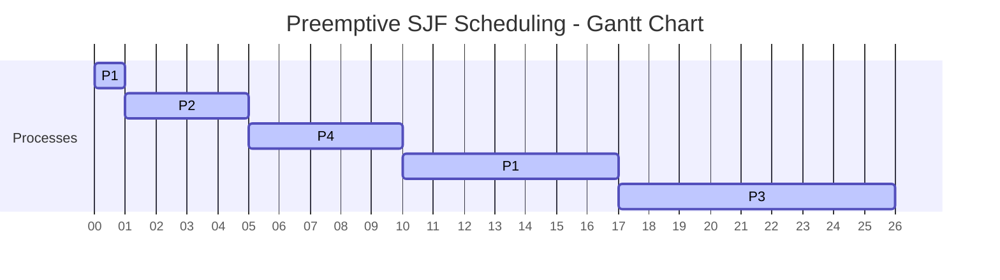

Process management: Process versus thread, CPU scheduling algorithms, threads and concurrency.

`Referencing` [book](<obsidian://open?vault=Kuwait-University-Computer-Engineering-Masters-Prep-2025&file=books%2F5%20-%20Operating%20Systems%2FAbraham%20Silberschatz%2C%20Greg%20Gagne%2C%20Peter%20B.%20Galvin%20-%20Operating%20System%20Concepts-Wiley%20(2018).pdf>)

---

### 1. Process Vs Thread

> 📖 **Process?** A process is a program in execution. It represents an independent unit of work with its own memory space, system resources, and execution context. Each process operates in its own address space and has at least one thread of execution.

> 🧵 **Thread?** A thread, sometimes called a lightweight process, is the smallest unit of CPU execution within a process. Threads within the same process share the same memory and resources, allowing for more efficient communication.

**Story time!**

Imagine a big office building called **"SudoCorp"**.
Each **process** is like a **separate office** inside the building. Every office has its own:

- Walls (memory),
- Employees (code),
- Office supplies (resources),
- And even its own coffee machine (CPU registers and stacks).

When two employees from different offices want to share a document (data), they have to go through formal communication—like emailing.

Now, inside each office (process), there may be **multiple employees working on different tasks**. These employees are like **threads**.

All the employees (threads) in one office:

- Share the same space (memory),
- Use the same supplies (resources),
- And can easily pass papers around without any formal request (because they live in the same room).

This means threads can work together faster and more efficiently, but there's a catch: if one employee spills coffee on the shared documents (memory corruption or crash), it affects everyone in that office (entire process).

But if something bad happens in one office (process)—say, a fire drill or power outage—the other offices continue to work just fine.

So basically, the thread is dependent on the process. Each process is independent of other processes.

**Thread Vs Process:**

| Aspect                  | Process                                       | Thread                                               |
| ----------------------- | --------------------------------------------- | ---------------------------------------------------- |
| **Definition**          | Independent program in execution              | **Lightweight** unit of execution within a process   |
| **Memory Space**        | Has its own memory and resources              | Shares memory and resources with other threads       |
| **Overhead**            | High (context switch involves more resources) | Low (context switch is faster)                       |
| **Creation Time**       | Slower (more system resources needed)         | Faster (less overhead)                               |
| **Fault Tolerance**     | Failure in one process doesn’t affect others  | Failure in one thread can affect the entire process  |
| **Resource Allocation** | Requires individual allocation by the OS      | Inherits process resources                           |
| **Scheduling**          | Scheduled independently by the OS             | May be scheduled independently or as part of process |

> 🤨 **Overhead?\*\*** Imagine you're writing an essay (the main task), but every 10 minutes, you stop to save the file, organize folders, and check your grammar settings. All that side work is **overhead** — it helps keep things running smoothly, but it’s not the actual writing. That's why using autosave and autocorrect in the grand scheme of things saves time (no overhead).

---

### 2. Process State (Review)

Before jumping into other topics its good to know what a process goes through.

The core things you need to understand about the graph above are:

1.  new processes need to go to the [New] section, it handles many processes at a time, the processes come from the _disk_. The processes are being **created** here.

2.  After the process goes through the [New queue] it goes to the [Ready queue] were the instructions are being **executed**. The [Ready queue] is in the _main memory_.

3.  From the [Ready queue] only one process gets out at a time. It has the option either to be selected by the _scheduler dispatch_ to go to the [Running] state or it stays in the current queue.

4.  When a process is in the [Running] state it can go back to the [Ready queue] if an interrupt occurs (software interrupt), or it can be terminated (exited or finished), orrr it can go the [Waiting queue] if an I/O interrupt occurs (example: waiting for keyboard response). All this happens in the **CPU** and the processes running at the same time depend on the number of **CORES** we have.

5.  What are **CORES** you might ask? imagine a human with two heads, theoretically they can think TWICE as much! so more cores = more thoughts per second (throughput)!

---

### 3. CPU Scheduling Algorithms

> 🦉 **CPU Scheduling?** A process migrates among the ready queue and various wait queues through- out its lifetime. The role of the CPU scheduler is to select from among the processes that are in the ready queue and allocate a CPU core to one of them.

**CPU scheduling may take place when a process:**

- Switches from running to waiting state
- Switches form running to ready state
- Switches from waiting to ready state

**There are two types of context switching in a CPU scheduler:**

1. **Preemptive**: Basically its an angry old man with zero patience! it wont wait for anything.. if its time for switching then its time for switching!
2. **Non-Preemptive:** The complete opposite, it will wait for the current process to finish before switching.

**Why use scheduling algorithms?**

- Max CPU utilization
- Max throughput
- Min turnaround time
- Min waiting time
- Min response time

**Before we jump into the algorithms its crucial to know these terminologies:**

1. **CPU utilization** – keep the CPU as busy as possible.
2. **Throughput** – # of processes that complete their execution per time unit.
3. **Turnaround time** – the total time the process needed from the response time till completion _(end time - response time)_ with respect to waiting time.
4. **Waiting time** – amount of time a process has been waiting in the ready queue.
5. **Response time** – the time the process first started executing.
6. **Burst time (execution time)** - The total time a process needs on the CPU to finish execution — without interruption.

#### 3.1 First Come First Served FCFS Algorithm

| Process | Arrival time | Burst Time | Start Time | Completion Time | Turnaround Time | Waiting Time |
| ------- | ------------ | ---------- | ---------- | --------------- | --------------- | ------------ |
| P1      | 0            | 4          | 0          | 4               | 4               | 0            |
| P2      | 1            | 3          | 4          | 7               | 6               | 3            |
| P3      | 2            | 2          | 7          | 9               | 7               | 5            |

### 3.2 Shortest Job First (SJF - Non-Preemptive)

| Process | Arrival time | Burst Time | Start Time | Completion Time | Turnaround Time | Waiting Time |
| ------- | ------------ | ---------- | ---------- | --------------- | --------------- | ------------ |
| P1      | 0            | 8          | 0          | 8               | 8               | 0            |
| P2      | 1            | 4          | 8          | 12              | 11              | 7            |
| P4      | 3            | 5          | 12         | 17              | 14              | 9            |
| P3      | 2            | 9          | 17         | 26              | 24              | 15           |

```mermaid
gantt
    title SJF Scheduling
    dateFormat  mm
    axisFormat  %M
    tickInterval 1minute

    section Processes
    P1 :active, p1, 2024-01-01 00:00, 8m
    P2 :active, p2, 2024-01-01 00:08, 4m
    P4 :active, p4, 2024-01-01 00:12, 5m
    P3 :active, p3, 2024-01-01 00:17, 9m

```

### 3.3 Priority Scheduling (Non-Preemptive)

| Process | Arrival time | Burst Time | Priority | Start Time | Completion Time | Turnaround Time | Waiting Time |
| ------- | ------------ | ---------- | -------- | ---------- | --------------- | --------------- | ------------ |
| P1      | 0            | 8          | 2        | 0          | 8               | 8               | 0            |
| P2      | 1            | 4          | 1        | 8          | 12              | 11              | 7            |
| P4      | 3            | 5          | 2        | 12         | 17              | 14              | 9            |
| P3      | 2            | 9          | 3        | 17         | 26              | 24              | 15           |

```mermaid
gantt
    title Priority Scheduling (Non-Preemptive)
    dateFormat  mm
    axisFormat  %M
    tickInterval 1minute

    section Processes
    P1 :active, p1, 2024-01-01 00:00, 8m
    P2 :active, p2, 2024-01-01 00:08, 4m
    P4 :active, p4, 2024-01-01 00:12, 5m
    P3 :active, p3, 2024-01-01 00:17, 9m

```

### 3.4 Round Robin (Time Quantum = 4)

There is a context switch whenever the Quantum finishes, the process goes back into the back of the waiting queue. The Q decreases by 1 with each time unit.

| Process | Arrival time | Burst Time | Start Time | Completion Time | Turnaround Time | Waiting Time |
| ------- | ------------ | ---------- | ---------- | --------------- | --------------- | ------------ |
| P1      | 0            | 8          | 0          | 24              | 24              | 16           |
| P2      | 1            | 4          | 4          | 9               | 8               | 4            |
| P3      | 2            | 9          | 8          | 26              | 24              | 15           |
| P4      | 3            | 5          | 12         | 20              | 17              | 12           |

```mermaid
gantt
    title Round Robin Scheduling (TQ=4)
    dateFormat  mm
    axisFormat  %M
    tickInterval 1minute

    section Processes
    P1 :active, p1a, 2024-01-01 00:00, 4m
    P2 :active, p2, 2024-01-01 00:04, 4m
    P3 :active, p3a, 2024-01-01 00:08, 4m
    P4 :active, p4a, 2024-01-01 00:12, 4m
    P1 :active, p1b, 2024-01-01 00:16, 4m
    P3 :active, p3b, 2024-01-01 00:20, 4m
    P4 :active, p4b, 2024-01-01 00:24, 1m
    P3 :active, p3c, 2024-01-01 00:25, 1m

```

> [!INFO] the smaller the QT the more context switches occur.

### 3.5 Shortest Job First (Preemptive!)

| **Process** | **Arrival Time** | **Burst Time** | **Start Time** | **Completion Time** | **Turnaround Time** | **Waiting Time** |
| ----------- | ---------------- | -------------- | -------------- | ------------------- | ------------------- | ---------------- |
| P1          | 0                | 8              | 0              | 8                   | 8                   | 0                |
| P2          | 1                | 4              | 8              | 12                  | 11                  | 7                |
| P3          | 2                | 9              | 4              | 15                  | 13                  | 4                |
| P4          | 3                | 5              | 12             | 17                  | 14                  | 9                |

> [!INFO] There are more available algorithms then the ones showed, there is a preemptive version for almost all the algorithms except FCFS.

---

### 4. **Comparing the Non-Preemptive Algorithms:**

- **First-Come, First-Served (FCFS)**:

  - **Best for**:
    - Simple environments with non-interactive processes.
  - **When to Use**:
    - When processes arrive in the order they should be executed.
  - **Pros**:
    - Easy to implement and understand.
  - **Cons**:
    - Can lead to **convoy effect** (long processes delay others).

- **Shortest Job First (SJF)**:

  - **Best for**:
    - Short, predictable tasks that are easy to measure.
  - **When to Use**:
    - When tasks can be predicted with short burst times.
  - **Pros**:
    - Minimizes average waiting time for burst-heavy workloads.
  - **Cons**:
    - Difficult to predict burst time, can lead to **starvation** (processes waiting for a long time).

- **Priority Scheduling**:

  - **Best for**:
    - Systems with varying process priorities.
  - **When to Use**:
    - When tasks have different priorities, such as system vs user tasks.
  - **Pros**:
    - Prioritizes important tasks.
  - **Cons**:
    - Can cause **starvation** for low-priority tasks, requires careful priority management.

- **Round Robin (RR)**:

  - **Best for**:
    - Time-sharing systems, fair allocation of CPU.
  - **When to Use**:
    - When tasks need to be executed in a fair and cyclical manner, e.g., for interactive systems.
  - **Pros**:
    - Simple and fair for all processes.
  - **Cons**:
    - Can cause higher turnaround times for longer processes.

- **Shortest Remaining Time First (SRTF)**:

  - **Best for**:
    - Systems with varying burst times.
  - **When to Use**:
    - When we want to minimize completion times and reduce waiting times in real-time systems.
  - **Pros**:
    - Optimizes for minimum average waiting time.
  - **Cons**:
    - Can cause **starvation** for longer processes, difficult to implement.

- **Multilevel Queue Scheduling**:
  - **Best for**:
    - Systems with multiple types of tasks.
  - **When to Use**:
    - When tasks need to be prioritized into different categories, such as interactive tasks vs CPU-bound tasks.
  - **Pros**:
    - Allows differentiation of tasks.
  - **Cons**:
    - Complex to implement, can lead to **starvation** if not managed carefully.

---

### 5. Threads & Concurrency

Single-threaded and multithreaded processes overview:
![[Single-threaded and multithreaded processes.png]]

> 🤨 **Concurrency?** Doing **multiple things at once** by **interleaving** tasks. Only one task may actually run at a time, but they **appear to run simultaneously**.

**There is a fine but clear distinction between concurrency and parallelism:**

- A concurrent system supports more than one task by allowing all the tasks to make progress. In contrast, a system is parallel if it can perform more than one task simultaneously. Thus, it is possible to have concurrency without parallelism.

**Concurrent execution on a single-core system:**
![[Concurrent execution on a single-core system.png]]

**Parallel execution on a multicore system:**
![[Parallel execution on a multicore system.png]]

---

> 🖋️ Author: Asmaa Alazmi
> This made me hungry 😵‍💫 ordering sushi after this...
