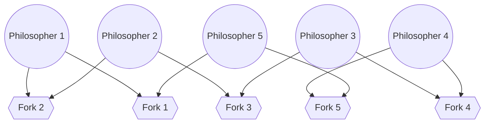

Process synchronization: classical synchronization problems (critical-section, readers-writers, dining philosophers, etc.), and synchronization tools (semaphores, monitors, etc.).  


`Referencing` [book](<obsidian://open?vault=Kuwait-University-Computer-Engineering-Masters-Prep-2025&file=books%2F5%20-%20Operating%20Systems%2FAbraham%20Silberschatz%2C%20Greg%20Gagne%2C%20Peter%20B.%20Galvin%20-%20Operating%20System%20Concepts-Wiley%20(2018).pdf>)

---

## Race Condition:

[Race Condition] is the name we give when we face this problem:

- When multiple processes try to access or change (read/write) data at the same time.
  So lets say we have process A which reads data1, process B write data1.. What will A have when it reads data1? the new data or the old data?

  ![[thinkmarkthink.png]]

## Critical Section Problem (C.S)

- Each code has a critical section (shared resources).. whats that? when one process is in the C.S no other may be in its C.S [A single process territory]. Keep in mind this problem only happens when **THREADING** is present.
- Each process must ask permission to enter critical section in entry section, may follow critical section with exit section, then remainder section

```C++
// General structure of a typical process.
while (true)
{
//entry section

CRITICAL SECTION

//exit section

REMINDER SECTION

}
```

### Sol1: Mutual Exclusion

- If process Pi is executing in its critical section, then no other processes can be executing in their critical sections.

### Sol2: Progress

- If no one is currently using the shared resource (critical section), and some programs (processes) are waiting to use it, then one of them must be allowed to go in soon. We **can't keep delaying** or ignoring them forever.

### Sol3: Bounded Waiting

- If a process (let’s call it **P1**) asks to enter the critical section, there must be a **limit** on how many other processes (like **P2**, **P3**, etc.) can go ahead of it **before P1 gets its turn**. In other words, **P1 shouldn't have to wait forever** while others keep going in.

### Hardware Solutions:

1. **Test-and-Set Instruction:** Sets a lock variable and checks it in one step.
2. **Compare-and-Swap:** Updates memory only if the current value matches an expected value.

---

## Software Locks (Solutions to C.S)

- These locks also work as a C.S solution but they are more diverse they can be implemented in multiple problems that will be discussed later on.

- Computers HATE resting! it needs to run 24/7 that's why having an idle state is BAD! hence, A **busy wait** occurs when a process repeatedly checks for a condition to be true (like checking if a lock is available) without releasing the CPU. It **keeps running** and **consuming CPU time** while waiting, instead of being put to sleep or paused until the condition is met.

### MUTEX locks

**Key Operations of Mutex Locks:**

1. **Lock (acquire)**:
   - A thread/process **requests** the lock.
   - If the lock is available, it’s granted, and the thread can enter the critical section.
2. **Unlock (release)**:
   - After completing its task, the thread **releases the lock**, making it available for other threads.

```C++
acquire() {
	while (!available)
		; /* busy wait */
		// loop till you get the lock!
		available = false;
}

release() {
	available = true;
}

do {
	//acquire lock
	critical section
	//release lock
	remainder section
} while (true);
```

### Semaphores

- A **semaphore** is a **synchronization primitive** used to control access to shared resources in a concurrent system, like multithreading or multiprogramming environments.

- It is essentially an **integer variable** that can be used to **signal** or **count** the availability of resources.

  **Types of Semaphores**:

1. **Binary Semaphore (Mutex-like)**:
   - Can only take values **0** or **1** (like a lock).
   - It’s used for **mutual exclusion** (basically mutex).
   - Only one thread can acquire the lock at a time, and others must wait.
2. **Counting Semaphore**:
   - Can take any **non-negative integer** value.
   - Used for managing access to a pool of resources (like a fixed number of items).
   - If the value is positive, a thread can proceed; otherwise, it must wait.

> **Example**:

    If you have 3 available printers, you can use a **counting semaphore** initialized to 3. When a thread (process) uses a printer, it **decreases** the semaphore (prints a "1"). When done, it **increases** the semaphore (returns the printer).

This is an abstract way of showing how a semaphore locks/unlocks a CS:

```C++
Initial value of semaphore = 0

ThreadJoin {
	// if semaphore = 0 then wait
	wait(semaphore);
	// semaphore = 1
}

ThreadFinish {
	signal(semaphore);
	// semaphore now = 0
}
```

**Semaphore vs Mutex**:

- **Semaphore**: Can allow multiple processes to access a resource (if counting semaphore). It’s not always exclusive.
- **Mutex**: Only one process can access the resource at a time.

> [!Info] There is an implementation for semaphores with no busy waiting.. more on that in the book.

### Monitors

- Basically does the same job as the ones above [too lazy to over explain it].

**Monitor vs Mutex/Semaphore**

- **Monitor**: Provides a higher-level abstraction and automatically handles mutual exclusion and synchronization (Monitor is a class).
- **Mutex/Semaphore**: Lower-level constructs that require manual handling of synchronization.

```C++
monitor PrinterMonitor {
    int printer = 1; // 1 = available, 0 = in use

    procedure printDocument() {
        if (printer == 0) {
            wait(printerAvailable); // wait until the printer is available
        }
        printer = 0; // set printer as in use
        // print the document
        signal(printerAvailable); // signal that the printer is available again
    }
}

```

> [!NOTE] Monitors are a bit complex then the rest.. personally i dont think its gonna be in the exam but if you're interested you can find plenty of info in the book.

---

### Readers-Writers Problem

A data set is shared among a number of concurrent processes

- **Readers** – only read the data set; they do not perform any updates.
- **Writers** – can both read and write.

> **Problem** **Statement** – allow **multiple readers** to read at the same time, but only one **single writer** can access the shared data at the same time. No reader kept waiting unless writer has permission to use shared object

    👉 **Semaphores are used as locks.**

The following abstract codes describes each structure:

```C++
//The structure of a **writer** process
do {

	wait(rw_mutex); // wait till all readers are done
	...
	/* writing is
	performed */
	...
	signal(rw_mutex); // unlock CS

} while (true);
```

```C++
//The structure of a **reader** process
do {

	wait(mutex); // lock writers out
	read_count++;

	if (read_count == 1)
		wait(rw_mutex);

	signal(mutex);
	...
	/* reading is performed
	*/
	...
	wait(mutex);
	read count--;

	if (read_count == 0)
		signal(rw_mutex);

	signal(mutex);

} while (true);
```

---

### Dining-Philosophers Problem

>     It’s a classic **synchronization problem** in computer science used to illustrate **deadlock**, **starvation**, and **resource sharing**.

**🍽️ The Setup:**

- Imagine **5 philosophers** sitting around a round table.
- Between each pair of philosophers is **1 fork** (so 5 forks total).
- Philosophers alternate between **thinking** and **eating**.
- To eat, a philosopher needs **2 forks** (left and right).
- Max number of philosophers [processes] at the same time in the C.S is **2**.



**Shared data**

- Bowl of rice (data set).
- Semaphore forks [5] initialized to 1.

**⚠️ The Problem:**

- If all philosophers pick up their **left fork** at the same time, none can pick up their **right fork** → **deadlock** (كلهم عالقين).
- A philosopher might **never get both forks** if others keep grabbing them → **starvation**.

**💡 Common Solutions:**

1. **Limit access** to 4 philosophers at a time.
2. Use a **mutex/monitor/semaphore** to control fork access.
3. Pick up **both forks at once** (atomic action).
4. Philosopher picks up **left if right is available** (prevents hold-and-wait).

```C++
//The structure of Philosopher i:
do {

	wait (chopstick[i] ); //pick up left fork
	wait (chopStick[ (i + 1) % 5] ); //pick up right fork
	// eat [enter CS]

	signal (chopstick[i] ); //put down left fork
	signal (chopstick[ (i + 1) % 5] ); //put down right fork
	// think [Waiting]

} while (TRUE);
```

> [!NOTE] This problem can be solved using Monitors as well.

---

> 🖋️ Author: Asmaa Alazmi
