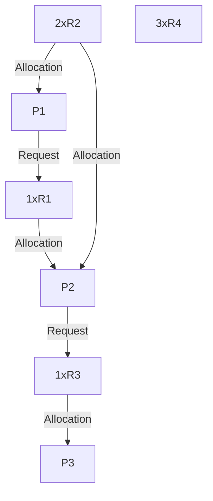
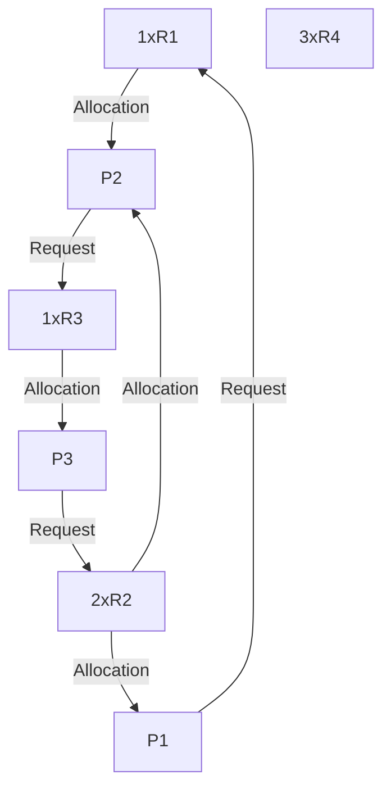
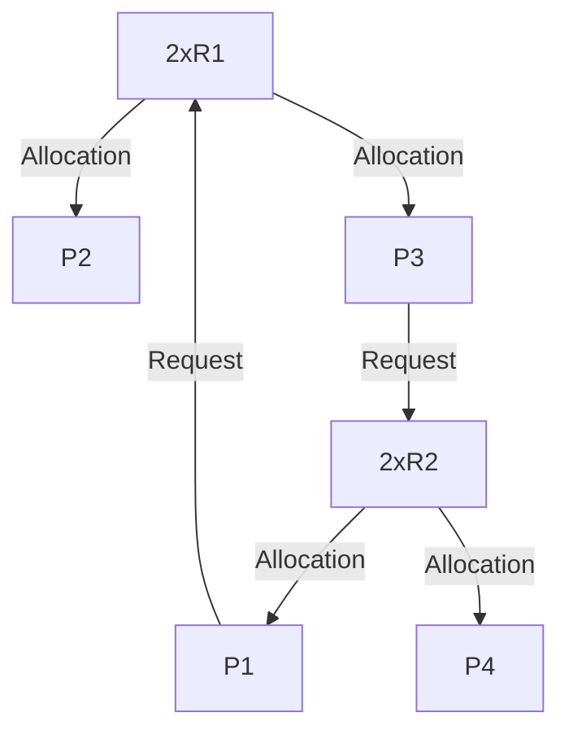

Process deadlock: deadlock model and methods for handling deadlocks: prevention, avoidance, and detection and recovery.
`Referencing` [book](<obsidian://open?vault=Kuwait-University-Computer-Engineering-Masters-Prep-2025&file=books%2F5%20-%20Operating%20Systems%2FAbraham%20Silberschatz%2C%20Greg%20Gagne%2C%20Peter%20B.%20Galvin%20-%20Operating%20System%20Concepts-Wiley%20(2018).pdf>)

---

## Deadlock Characterization

Deadlock only happens when all the following are **true**:

1. **Mutual exclusion:** only one process at a time can use a resource.
2. **Hold and wait:** a process holding at least one resource is waiting to acquire additional resources held by other processes.
3. **No preemption:** a resource can be released only voluntarily by the process holding it, after that process has completed its task.
4. **Circular wait:** there exists a set {P0, P1, …, Pn} of waiting processes such that P0 is waiting for a resource that is held by P1, P1 is waiting for a resource that is held by P2, …, Pn–1 is waiting for a resource that is held by Pn, and Pn is waiting or a resource that is held by P0 (بطتنا بطت بطتكم).

### Resource-Allocation graph

R = {1xR1, 2xR2, 1xR3, 3xR4}
E = {P1 -> R1, P2 -> R3, R1 -> P2, R2 -> P2, R2 -> P1, R3 -> P3}

with deadlock:
R = {1xR1, 2xR2, 1xR3, 3xR4}
E = {P1 -> R1, P2 -> R3, R1 -> P2, R2 -> P2, R2 -> P1, R3 -> P3, P3 -> R2}

With cycle but no deadlock:
R = {2xR1, 2xR2}
E = {P1 -> R1, R1 -> P2, R1 -> P3, P3 -> R2, R2 -> P1, R2 -> P4}

> [!NOTE] If graph has no cycles, then it is **safe**.
> If graph has cycles, then it is **unsafe**.
> If only one insstance of a resouve type exists in the system, then the system is in a **deadlock** state.
> If multiple instances of a resource type exist, then the system has a possibility to be in a **deadlock**

---

## Deadlock Prevention (Break one of the above!)

Enduring that the system will **NEVER** enter a deadlock state!

- **Deny Mutual Exclusion** (Not practical for non-sharable resources like printers).
- **Deny Hold and Wait**  
   → Require processes to request all resources at once.  
   🔸 Downsides: Can cause **low resource utilization** and **starvation**.
- **Deny No Preemption**  
   → Allow system to **forcibly take resources** if a process is waiting.  
   🔸 Used in CPU scheduling or memory management sometimes.
- **Deny Circular Wait**  
   → Impose a **fixed order** of resource requests (number resources & request in increasing order).  
   🔸 Simple and commonly used.

---

## Deadlock Avoidance

Ensuring that the system will **NEVER** enter a deadlock state!
**🎯 Key Idea:**
Before allocating resources, the system checks if doing so keeps it in a **safe state** (where all processes can finish eventually).
**🧠 How It's Done:**
Each process tells the system its **maximum resource needs** in advance. then the system uses algorithms to **simulate** allocations and check if the result is **safe**.
**📌 Drawbacks:** - Requires knowing **max needs** ahead of time. - More **complex** and **costly** than prevention.

> [!INFO] there is something called the Banker's Algorithm for deadlock avoidance that checks if the allocations are safe or not... you can take a look at it in the book.

---

> 🖋️ Author: Asmaa Alazmi
