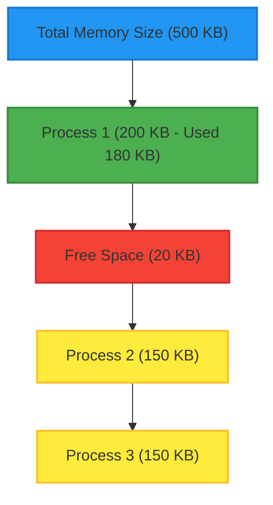
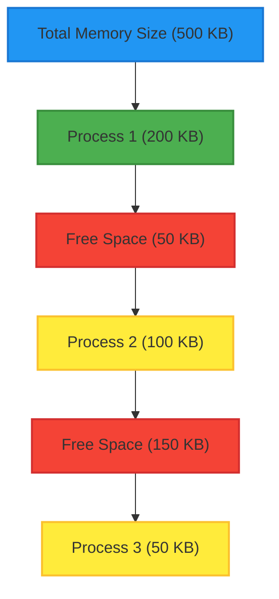

`Referencing` [book](<obsidian://open?vault=Kuwait-University-Computer-Engineering-Masters-Prep-2025&file=books%2F5%20-%20Operating%20Systems%2FAbraham%20Silberschatz%2C%20Greg%20Gagne%2C%20Peter%20B.%20Galvin%20-%20Operating%20System%20Concepts-Wiley%20(2018).pdf>)

---

### 1. Background

- Program must be brought (from disk) into memory and placed within a process for it to be run.
- Main memory and registers are only storage CPU can access directly.
- Register access is done in one CPU clock (or less).

Storage-device hierarchy:
![[Storage-device hierarchy.png]]

---

### 2. Fragmentation (مقطع)

When memory is allocated and freed, it can become **broken into pieces**, leading to **fragmentation**.

> 🤓☝️ **Fragmentation** occurs in **contiguous memory** systems, where memory is allocated in **one single block** (cannot split data). Welp this means that fragmentation IS the problem in contiguous memory.

**Types of Fragmentation:**

1. **Internal Fragmentation**
   happens when the allocated block is larger than needed, causing unused space within the same block.
   - **Cause**: Fixed-size memory blocks (like in paging).
   - **Wasted space** _inside_ allocated memory.
   - Example: You allocate 100KB but only use 90KB, so 10KB wasted.
2. **External Fragmentation**
   happens when there are small unused gaps scattered between allocated blocks.
   - **Cause**: Variable-size memory blocks (like in segmentation).
   - **Wasted space** _between_ allocated memory blocks.
   - Example: Enough total free memory, but not in one big chunk.

**2.1 Internal Fragmentation (Horizontal Layout)**

`As you can see a lot of empty space that's not used properly!

**2.2 External Fragmentation (Horizontal Layout)**:

---

### 3. Paging

We take our **virtual memory** and divide it into chunks called **PAGES**.
Then we take our **physical memory** and divide it into chunks called **FRAMES**.
👉 Page size will always be qual to frame size!
Unlike Fragmentation paging happens in non contiguous system were data don't need to be stored all together in one block.

![[Paging hardware-1.png]]

**How do we implement it?**
Lets just jump into an example problem:

> [!question] Assume, physical memory of size 32 Byte, Page size 4 B, Logical memory of size 64 Byte.
> a) How many pages are there in the logical memory?
> b) How many frames?
> c) How many bits are used for the offset

Lets solve (a) first:
$$\#\text{ of pages} = \frac{\text{Logical Address (LA) Size}}{\text{Page Size}} = \frac{2^6}{2^2} = 2^4 = 16$$

Next, (b):
$$\#\text{ of frames} = \frac{2^5}{2^2} = 2^3 = 8$$

Finally (c):

$$
m - n = 6 - 2 = 4 \text{ bits}
$$

> [!NOTE] Personally i don't think this will come in the exam ;)

---

### 4. Paging Vs Fragmentation

| Feature                | Paging                                         | Fragmentation            |
| ---------------------- | ---------------------------------------------- | ------------------------ |
| Memory Allocation      | Non Contigoues                                 | Contigoues               |
| Fragmentation Possible | Only Internal                                  | External and Internal    |
| Speed                  | Slight overhead because of address translation | Direct addressing (Fast) |
| Flexibility            | More flexible                                  | Less flexible            |

`These were all the fuetures i could think of.. ;d`

---

> [!warning] Skipped these sections.. your on your own soldier!
> virtual memory (replacement algorithms, page-frame allocation relation, and thrashing), file system (access methods, file and directory structures, and file and directory implementation).

---

> 🖋️ Author: Asmaa Alazmi
