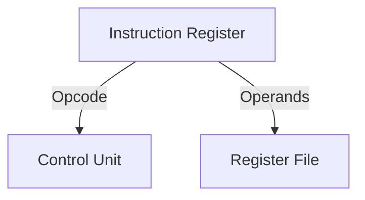
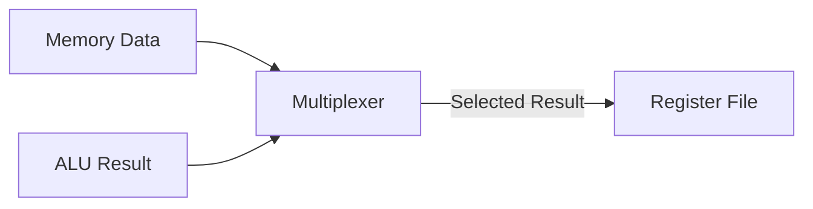
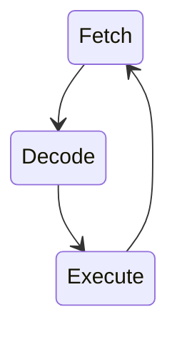

Processor Data Path and Control Unit Design

## Data Path Components
![[Datapath.png]]
![[Abstracted-datapath.png]]
The data path consists of the hardware elements that process data:

1. **Registers**

   - Program Counter (PC)
   - Instruction Register (IR)
   - General Purpose Registers
   - Status Register (Flags)

2. **ALU**

   - Arithmetic operations
   - Logic operations
   - Shift/rotate operations

3. **Buses**
   - Internal data bus
   - Address bus
   - Control bus


## Basic Data Path Operations

Each instruction goes through these phases:

### 1. Instruction Fetch (IF)

- PC provides address of next instruction
- Memory returns instruction at that address
- Instruction loaded into IR
- PC incremented to point to next instruction


### 2. Instruction Decode (ID)

- IR breaks instruction into:
  - Operation code (what to do)
  - Source operands (where to get data)
  - Destination (where to put result)
- Control unit activates appropriate control signals
- Register addresses decoded to access register file



### 3. Execute (EX)

- ALU performs operation specified by instruction
- For arithmetic/logic: performs calculation
- For memory: calculates effective address
- For branch: calculates target address
- Results stored in temporary registers
- Status flags updated based on result


### 4. Memory Access (MEM)

- Access memory if needed:
  - Load: Read data from memory
  - Store: Write data to memory
- Skip for non-memory instructions
- Address calculated in EX stage is used here


### 5. Write Back (WB)

- Write result to destination register
- Result can come from:
  - ALU operation (from EX)
  - Memory read (from MEM)
- Updates processor state



> [!tip] Pipeline Note
> Modern processors overlap these stages:
>
> - While one instruction executes
> - Next instruction decodes
> - Third instruction fetches
>   This is called pipelining and significantly improves performance

## Control Unit Design

The control unit generates signals to coordinate data path operations.

### Control Signals

1. **Register Control**

   ```
   RegWrite    - Enable register writing
   RegRead     - Enable register reading
   RegSel      - Select register
   ```

2. **ALU Control**

   ```
   ALUOp       - Operation type
   ALUSrc      - Source operand select
   ```

3. **Memory Control**
   ```
   MemRead     - Enable memory reading
   MemWrite    - Enable memory writing
   MemtoReg    - Data to register
   ```

### Control Unit States



## Example: ADD Instruction

```assembly
ADD R1, R2, R3  ; R1 = R2 + R3
```

Control sequence:

1. **Fetch**

   ```
   PC → MAR
   Memory → IR
   PC + 4 → PC
   ```

2. **Decode**

   ```
   IR(25-21) → RegSel1
   IR(20-16) → RegSel2
   IR(15-11) → RegDest
   ```

3. **Execute**
   ```
   R[RegSel1] → A
   R[RegSel2] → B
   A + B → Result
   Result → R[RegDest]
   ```

## Control Unit Implementation

### 1. Hardwired Control

```verilog
module control_unit(
    input [5:0] opcode,
    output reg RegWrite,
    output reg ALUSrc,
    output reg MemRead,
    output reg MemWrite
);
    always @(opcode) begin
        case(opcode)
            6'b000000: begin // R-type
                RegWrite = 1;
                ALUSrc = 0;
                MemRead = 0;
                MemWrite = 0;
            end
            // ... other cases
        endcase
    end
endmodule
```

### 2. Microprogrammed Control

Uses microcode stored in ROM:

```
Address  Control Word
000      RegRead, ALUSrc0
001      ALUOp, RegWrite
010      MemRead, RegWrite
...
```

## Performance Considerations

1. **Critical Path**

   - Longest delay path determines clock period
   - Usually through ALU or memory access

2. **Pipeline Hazards**

   ```mermaid
   graph TD
       A[Data Hazards]
       B[Control Hazards]
       C[Structural Hazards]
   ```

3. **Optimization Techniques**
   - Forwarding paths
   - Branch prediction
   - Out-of-order execution

> [!tip] Design Tips
>
> 1. Minimize critical path length
> 2. Balance pipeline stages
> 3. Optimize frequent operations
> 4. Consider power consumption
