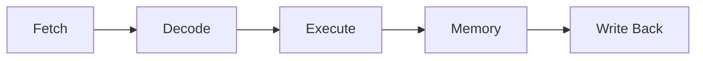
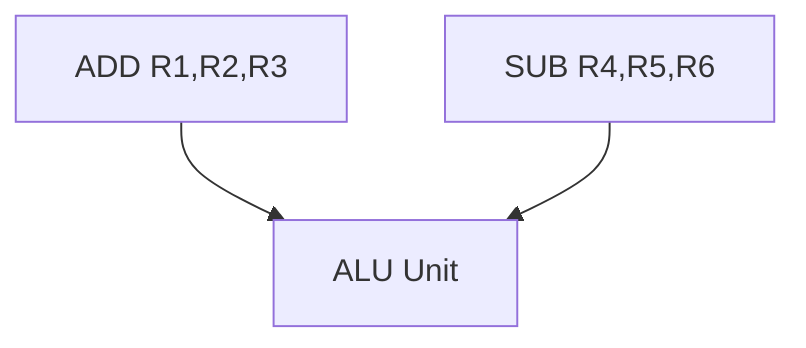
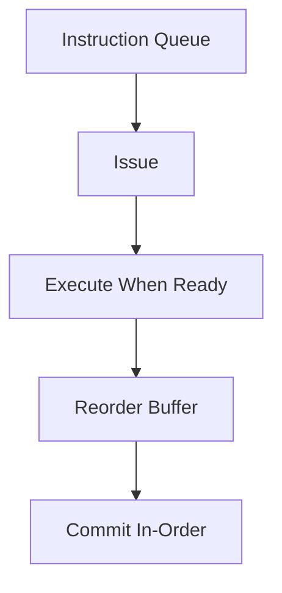

Pipelining in Processor Design

## Basic Pipeline Concept

Pipelining executes multiple instructions simultaneously, each in a different stage.

### Classic 5-Stage Pipeline



Without pipelining (5 cycles per instruction):

```
Inst1: |IF|ID|EX|MEM|WB|
Inst2:           |IF|ID|EX|MEM|WB|
```

With pipelining (1 instruction per cycle ideal):

```
Inst1: |IF|ID|EX|MEM|WB|
Inst2:    |IF|ID|EX|MEM|WB|
Inst3:       |IF|ID|EX|MEM|WB|
```

## Pipeline Hazards

![[Forwarding-in-Hazard.png]]

### 1. Structural Hazards

Multiple instructions need same hardware resource.



**Solutions:**

- Resource duplication
- Resource scheduling

### 2. Data Hazards

Instruction needs result from previous instruction.

```assembly
ADD R1, R2, R3   ; R1 = R2 + R3
SUB R4, R1, R5   ; R4 = R1 - R5  (needs R1 from previous)
```

**Solutions:**

1. **Forwarding/Bypassing**

   ```mermaid
   graph LR
       ALU -->|Result| FWD[Forward]
       FWD -->|Early| NextInst
   ```

2. **Register Renaming**
   ```
   Original:          Renamed:
   ADD R1, R2, R3    ADD R1a, R2, R3
   SUB R1, R1, R4    SUB R1b, R1a, R4
   MUL R5, R1, R6    MUL R5, R1b, R6
   ```

### 3. Control Hazards

Branch instructions make next instruction uncertain.

```assembly
BEQ R1, R2, Label  ; If R1=R2, goto Label
ADD R3, R4, R5     ; Should this execute?
SUB R6, R7, R8     ; Or this?
Label: MUL R9, R10, R11
```

**Solutions:**

1. **Branch Prediction**

   - Static: Always predict taken/not taken
   - Dynamic: Use history table

2. **Delayed Branch**
   ```assembly
   BEQ R1, R2, Label  ; Branch
   ADD R3, R4, R5     ; Delay slot (always executes)
   Label: ...
   ```

## Performance Impact

### Pipeline CPI

```
CPI = Ideal CPI + Structural Stalls + Data Stalls + Control Stalls
```

### Example:

For a program with:

- 20% branches
- 5% structural hazards
- 15% data hazards

```
Effective CPI = 1 + 0.05 + 0.15 + 0.2 = 1.4
```

## Advanced Techniques

### 1. Out-of-Order Execution



### 2. Speculative Execution

- Execute beyond branches
- Roll back if prediction wrong

### 3. Superscalar Pipeline

```
            |IF|ID|EX|MEM|WB|
Pipe1: Inst1|==|==|==|==|==|
Pipe2: Inst2|==|==|==|==|==|
```

> [!tip] Design Considerations
>
> 1. Balance pipeline stages
> 2. Minimize hazard impact
> 3. Consider power/complexity trade-offs
> 4. Use efficient forwarding paths
