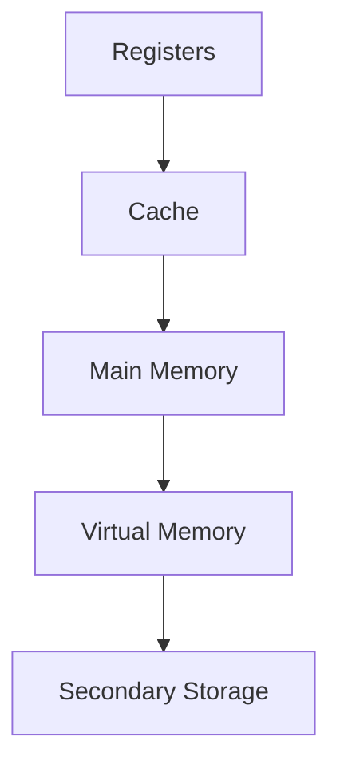
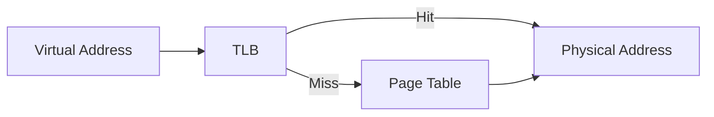

Memory Technology and Cache Design

## Memory Hierarchy



## Cache Memory

### Basic Concepts

- Smaller, faster memory between CPU and main memory
- Holds frequently accessed data
- Managed by hardware

### Cache Organization

1. **Direct Mapped**: Each memory location maps to exactly one cache location

   ```
   Cache Location = Memory Address MOD Cache Size
   ```

2. **Set Associative**: Each memory location can go in n locations
3. **Fully Associative**: Memory location can go anywhere

### Hit Rate Calculations

```
Hit Rate = Hits / (Hits + Misses)
Average Access Time = Hit Time + (Miss Rate × Miss Penalty)
```

Example:

```
Hit Rate = 0.8 (80%)
Hit Time = 1 cycle
Miss Penalty = 10 cycles

Average Access Time = 1 + (0.2 × 10) = 3 cycles
```

## Virtual Memory

### Address Structure

A virtual address consists of two parts:

1. Virtual Page Number (VPN)
2. Page Offset

For example, in a system with:

- Virtual address size = m bits
- Page size = 2^n bytes
- Page offset = n bits
- Virtual page number = (m-n) bits

### Virtual to Physical Translation

![[Virtual-Physical-Translation.png]]

1. **Page Offset**:

   - Determined by page size
   - Same in both virtual and physical addresses
   - Example: For 16KB pages
     ```
     Page Offset = log2(16KB) = log2(16384) = 14 bits
     ```

2. **Page Number**:
   - Virtual Page # = Total bits - Offset bits
   - Physical Page # = Physical address bits - Offset bits
   - Example: For 40-bit virtual, 32-bit physical addresses
     ```
     Virtual Page # = 40 - 14 = 26 bits
     Physical Page # = 32 - 14 = 18 bits
     ```

### Example Calculation

Given:

- 40-bit virtual address
- 16KB pages
- 32-bit physical address
- TLB: 8 entries, fully associative
- 4 bits for control (Valid, protection, dirty, use)

Calculate:

1. Page Offset = log2(page size) = log2(16KB) = 14 bits
2. Virtual Page Number = 40 - 14 = 26 bits
3. Physical Page Number = 32 - 14 = 18 bits

TLB Entry size:

```
|Valid,Dirty,etc|Virtual Page #|Physical Page #|
|      4       |     26      |      18      | bits
Total = 48 bits per entry
```

### Page Size Calculations

```
Page Size = 2^n bytes (where n is number of offset bits)
Number of Pages = Total Memory Size / Page Size
```

Example:

```
Memory Size = 4GB = 2^32 bytes
Page Size = 4KB = 2^12 bytes
Number of Pages = 2^32 / 2^12 = 2^20 pages
```

### Address Translation

Physical Address = (Page Number × Page Size) + Offset

For a 32-bit address with 4KB pages:

- Offset bits = 12 (2^12 = 4096 bytes)
- Page number bits = 20 (32 - 12)

### Page Table Entry (PTE)

```
|Valid Bit|Modified Bit|Referenced Bit|Protection|Page Frame Number|
|   1    |     1     |      1      |    3     |       20       | bits
```

### TLB (Translation Lookaside Buffer)

- Cache for page table entries
- Contains most recently used translations



## Memory Performance

### Access Time Calculation

```
Effective Access Time =
    (Hit Rate × Hit Time) +
    (Miss Rate × (Hit Time + Memory Access Time))
```

Example:

```
Hit Rate = 0.95
Hit Time = 1ns
Memory Access = 100ns

Effective Time = (0.95 × 1) + (0.05 × (1 + 100))
                = 0.95 + 5.05
                = 6ns
```

### Memory Bandwidth

```
Bandwidth = Bus Width × Clock Frequency
```

Example:

```
64-bit bus at 200MHz = 64 bits × 200,000,000 = 12.8 Gbps
```

## Common Calculations

1. **Cache Size**

```
Total Cache Size =
    Number of Lines ×
    (Line Size + Valid Bit + Tag Bits)
```

2. **Tag Bits**

```
Tag Bits =
    Address Bits -
    (Log2(Number of Lines) + Log2(Line Size))
```

3. **Page Table Size**

```
Page Table Size =
    Number of Pages ×
    Size of Page Table Entry
```

Example:

```
4GB address space
4KB pages
4 bytes per PTE

Number of Pages = 2^32/2^12 = 2^20
Page Table Size = 2^20 × 4 = 4MB
```

> [!tip] Memory Design Trade-offs
>
> 1. Larger page size:
>    - Less page table entries (+)
>    - More internal fragmentation (-)
> 2. Larger cache line size:
>    - Better spatial locality (+)
>    - Higher miss penalty (-)
> 3. More cache associativity:
>    - Lower miss rate (+)
>    - More complex hardware (-)
