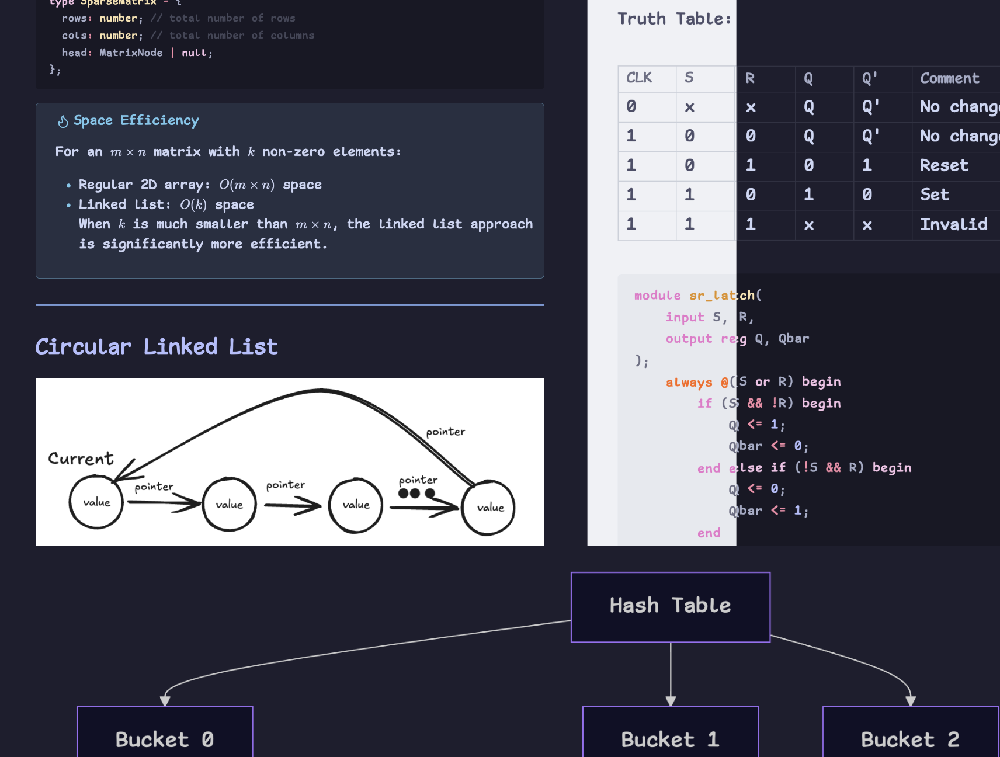
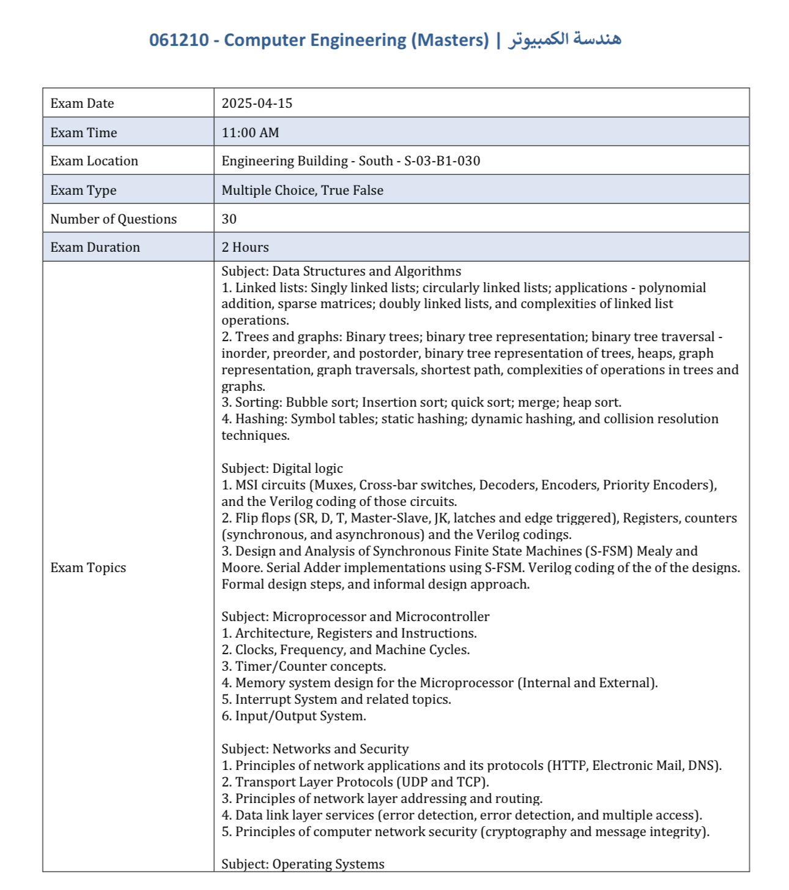
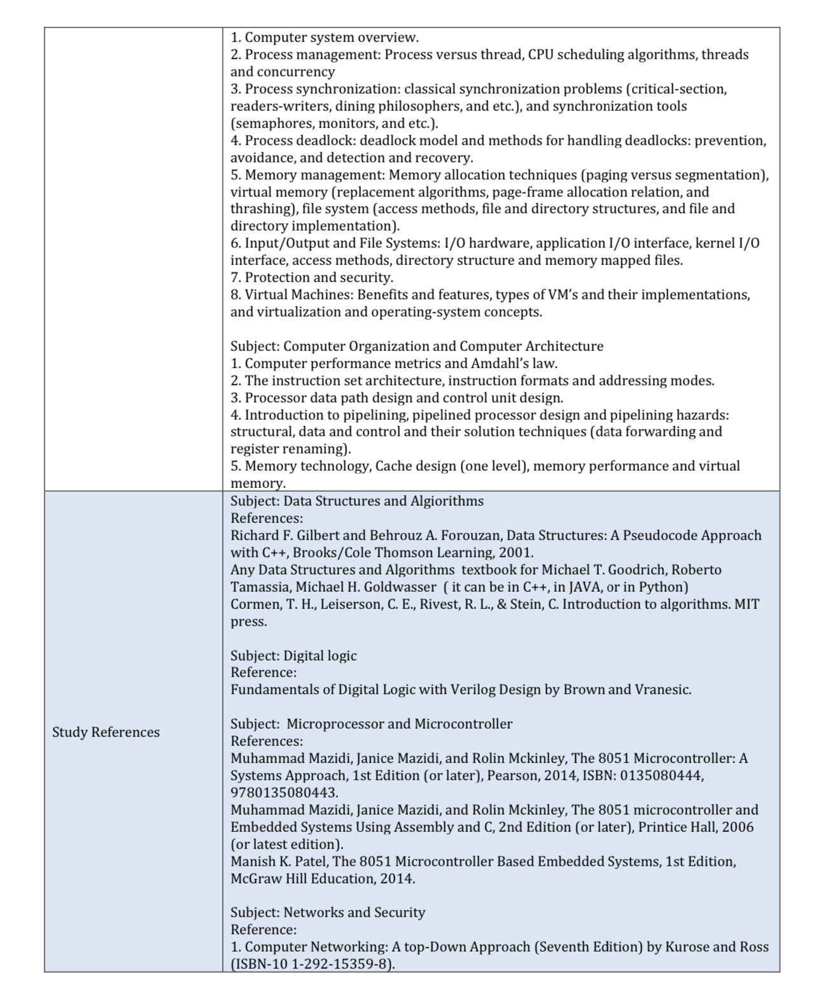
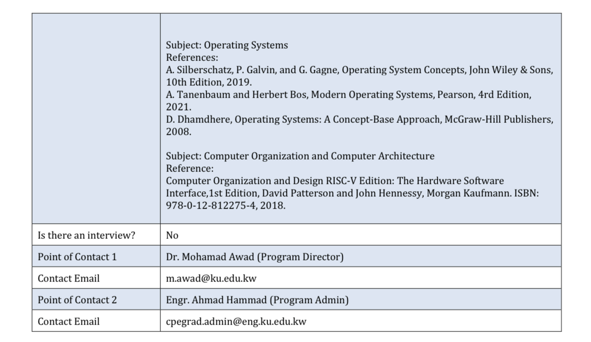

# Kuwait University Computer Engineering Masters Prep


As the Master's exam in Kuwait University approaches, I've created this repository to keep all my notes and study material here. These are *not* introductory notes, but rather revisions to help remember the topics required in the exam. As such, prior experience and knowledge is required. For example, I won't go over what "binary" is, how to count with it, This is **NOT** a replacement for the official study books.


> [!Note] 
> These notes include my thoughts and ideas, fun facts, sometimes jokes, sometimes "professional" explanations. 
> If you're looking for a more serious tone, I recommend you create your own set of notes:)


## How to use these notes
These notes are written in [obsidian](https://obsidian.md/). So although they are "just" `.md` files and you can view them anywhere, I recommend viewing them in obsidian to get the best experience. Obsidian's [linking](https://help.obsidian.md/links) feature is enough of a reason to download and use it, as it helps to navigate between the notes. Feel free to create PDFs of these notes.

To open in obsidian:
1. Download this repository or clone:
```bash
$ git clone https://github.com/Cyberistic/Kuwait-University-Computer-Engineering-Masters-Prep-2025
```
2. From within obsidian, press on the bottom left button below the file explorer -> Open folder as vault -> Select the repository.
3. Enjoy :)

## Structure






Following the official list from the university: 
1. Each subject will have its own folder
2. Each topic will live in its own note, containing all subtopics within the topic (to help with studying topic by topic)
3. If a topic requires prerequisite knowledge and it doesn't exist in other notes, it will be added to the `misc` folder. *This does not mean there will be explanations for all prerequisites!! Just things I feel like are necessary*
4. In each folder there will be a QUIZ note, with general multiple-answer questions related to the subject. The best way to use this is try to solve them, and if you get them wrong, ask an AI to explain it to you.


## Contribution 
If you're also studying for the exam, feel free to contribute and submit PRs. I will review and add them accordingly (and credit you below). If you're from the future, hello future person 👋🏻 you can fork this repository and adjust it to your needs. Make sure to ask your instructors for the updated topics list!

## Contributors 
Special thanks to:
- me
- [xXAsoomaVIP906Xx](https://github.com/ProjectCodeKw)

## Ending remarks?
uhh follow [@sudo_kw](https://instagram.com/@sudo_kw) thank u :)


## LICENSE
do whatever you want with the notes, copy them, edit them, redistribute them as your own, whatever. Just please don't sue me if you fail the exam
