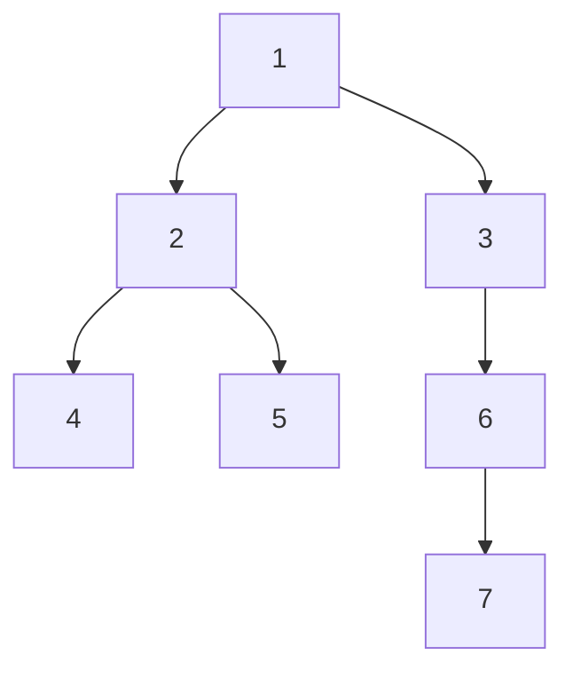

### Definitions

- **Depth of a node**: Number of edges from the root to that node.

- **Height of a node**: Number of edges on the longest downward path to a leaf from that node.

- **Height of the tree**: Height of the root node.

###  Depth and Height in a Tree 

####  **Depth of a Node**

The **depth** of a node is _how far it is from the root_ — in other words, the number of steps (or edges) you take to reach it from the root.

- The **root node** always has a depth of `0`.
    
- If a node has a parent, its depth is **1 more than its parent’s depth**.
    

Example:  
If a node has a parent at depth `2`, then its own depth is `3`.

You can also define depth using this rule:

- **If the node is the root**, its depth is `0`.
- **Otherwise**, depth = `1 + depth of its parent`.