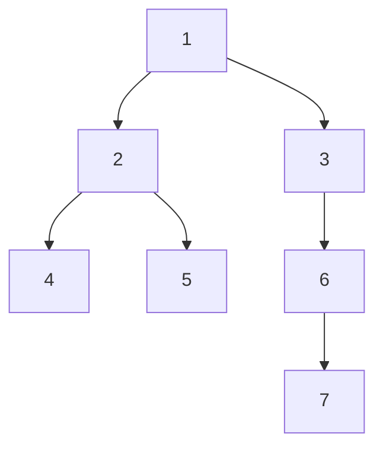

### Definitions

- **Depth of a node**: Number of edges from the root to that node.

- **Height of a node**: Number of edges on the longest downward path to a leaf from that node.

- **Height of the tree**: Height of the root node.

###  Depth and Height in a Tree 




- Height of node: how many nodes are below it (longest path).
- Depth of node: how many nodes are above it (longest path).

Boring facts:
- The **root node** always has a depth of `0`.
- If a node has a parent, its depth is **1 more than its parent’s depth**.


#### Implementation 
```ts
type TreeNode = {
  val: number;
  left?: TreeNode;
  right?: TreeNode;
};

// Recursive function to compute height of a node
function getHeight(node?: TreeNode): number {
  if (!node) return -1; // height of empty tree is -1
  return 1 + Math.max(getHeight(node.left), getHeight(node.right));
}

// Recursive function to compute depth of a target node
function getDepth(root: TreeNode | undefined, target: number, depth = 0): number {
  if (!root) return -1;
  if (root.val === target) return depth;

  const left = getDepth(root.left, target, depth + 1);
  if (left !== -1) return left;

  return getDepth(root.right, target, depth + 1);
}

```