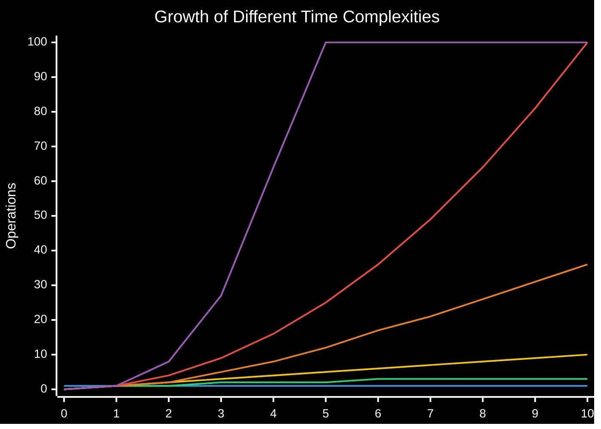

# Time Complexities

Time complexity is a way to express how the runtime of an algorithm grows as the size of the input increases.

## Visual Comparison of Time Complexities



**Chart Legend:**

- Blue: O(1) - Constant Time
- Green: O(log n) - Logarithmic Time
- Yellow: O(n) - Linear Time
- Orange: O(n log n) - Linearithmic Time
- Red: O(n²) - Quadratic Time
- Purple: O(n³) - Cubic Time

> [!note] Note on the chart
> The values for O(2ⁿ) and O(n!) grow too quickly to display on the same chart (at n=10, O(2ⁿ) = 1024 and O(n!) = 3,628,800), so they've been omitted from the visual representation.

## Common Time Complexities (From Best to Worst)

O(1) -> O(log n) -> O(n) -> O(n log n) -> O(n²) -> O(n³) -> O(2ⁿ) -> O(n!)

### O(1) - Constant Time

- **Examples**:
  - Array access by index
  - Hash table insertion/lookup (average case)
  - Stack operations (push/pop)

### O(log n) - Logarithmic Time

- **Examples**:
  - Binary search
  - Operations on balanced binary search trees
  - Divide and conquer algorithms

### O(n) - Linear Time

- **Examples**:
  - Linear search
  - Traversing arrays or linked lists
  - Finding min/max in an unsorted array

### O(n log n) - Linearithmic Time

- **Examples**:
  - Efficient sorting algorithms (Merge sort, Heap sort, Quick sort average case)
  - Many divide and conquer algorithms

### O(n²) - Quadratic Time

- **Examples**:
  - Bubble sort, Insertion sort, Selection sort
  - Nested loops iterating over the same collection
  - Comparing all pairs of elements in an array

### O(n³) - Cubic Time

- **Examples**:
  - Some inefficient matrix operations
  - Floyd-Warshall algorithm for finding shortest paths in a graph
  - Some dynamic programming solutions

### O(2ⁿ) - Exponential Time

- **Examples**:
  - Recursive Fibonacci calculation
  - Power set calculation
  - Brute force solutions to the Traveling Salesman Problem

### O(n!) - Factorial Time

- **Examples**:
  - Generating all permutations of a set
  - Brute force solution to the Traveling Salesman Problem
  - Deterministically solving NP-complete problems

> [!note] Memory Complexity
> Don't forget that algorithms also have space complexity, which measures the amount of memory required as input size grows. Space-time tradeoffs are often important considerations in algorithm design.

## Examples of Calculating Time Complexity

### From Code Snippets

#### Example 1: O(1) - Constant Time

```javascript
function constantTime(arr) {
  return arr[0]; // Direct access to first element
}
```

#### Example 2: O(n) - Linear Time

```javascript
function linearTime(arr) {
  let sum = 0;
  for (let i = 0; i < arr.length; i++) {
    sum += arr[i]; // One operation per element
  }
  return sum;
}
```

#### Example 3: O(n²) - Quadratic Time

```javascript
function quadraticTime(arr) {
  let result = [];
  for (let i = 0; i < arr.length; i++) {
    for (let j = 0; j < arr.length; j++) {
      result.push(arr[i] * arr[j]); // Nested loops over the same array
    }
  }
  return result;
}
```

#### Example 4: O(log n) - Logarithmic Time

```javascript
function binarySearch(arr, target) {
  let left = 0;
  let right = arr.length - 1;

  while (left <= right) {
    let mid = Math.floor((left + right) / 2);
    if (arr[mid] === target) return mid;
    if (arr[mid] < target) left = mid + 1;
    else right = mid - 1;
  }
  return -1;
}
```

### From Polynomials

When analyzing algorithms, we often encounter polynomial expressions. Here's how to determine the time complexity:

1. **3n² + 2n + 1**: The highest power term dominates as n grows, so this is O(n²)
2. **5n + 20**: This is simply O(n)
3. **2ⁿ + n²**: The exponential term dominates, so this is O(2ⁿ)
4. **log(n) + n**: The linear term dominates, so this is O(n)
5. **n log(n) + n²**: The quadratic term dominates, so this is O(n²)

### From Recursion

Determining the time complexity of recursive algorithms requires understanding the recurrence relation.

#### Example 1: Simple Recursion - O(n)

```javascript
function factorial(n) {
  if (n <= 1) return 1;
  return n * factorial(n - 1); // One recursive call, reducing by 1 each time
}
```

#### Example 2: Binary Recursion - O(2ⁿ)

```javascript
function fibonacci(n) {
  if (n <= 1) return n;
  return fibonacci(n - 1) + fibonacci(n - 2); // Two recursive calls
}
```

#### Example 3: Divide and Conquer - O(n log n)

```javascript
function mergeSort(arr) {
  if (arr.length <= 1) return arr;

  const mid = Math.floor(arr.length / 2);
  const left = mergeSort(arr.slice(0, mid));
  const right = mergeSort(arr.slice(mid));

  return merge(left, right); // Merge is O(n), and we divide the problem in half each time
}
```

#### Calculating Complexity for Recursion:

For recursion problems, you can use the **Master Theorem** for divide-and-conquer recurrences:

- T(n) = aT(n/b) + f(n)
  - a = number of subproblems
  - b = factor by which the problem size is reduced
  - f(n) = cost of dividing and combining

Common recurrence relations:

- T(n) = T(n-1) + 1 → O(n) [Ex: factorial]
- T(n) = T(n-1) + n → O(n²) [Ex: selection sort]
- T(n) = 2T(n/2) + n → O(n log n) [Ex: merge sort]
- T(n) = 2T(n-1) + 1 → O(2ⁿ) [Ex: naive Fibonacci]
