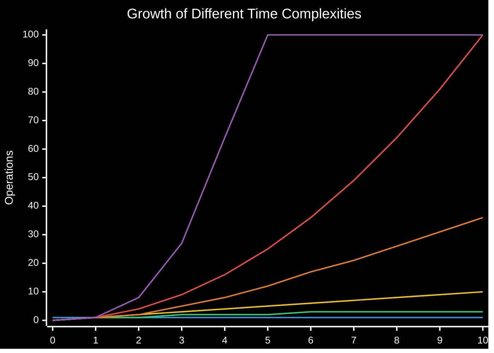

# Time Complexities

Time complexity is a way to express how the runtime of an algorithm grows as the size of the input increases.

## Visual Comparison of Time Complexities

**Chart Legend:**

- Blue: O(1) - Constant Time
- Green: O(log n) - Logarithmic Time
- Yellow: O(n) - Linear Time
- Orange: O(n log n) - Linearithmic Time
- Red: O(n²) - Quadratic Time
- Purple: O(n³) - Cubic Time

> [!note] Note on the chart
> The values for O(2ⁿ) and O(n!) grow too quickly to display on the same chart (at n=10, O(2ⁿ) = 1024 and O(n!) = 3,628,800), so they've been omitted from the visual representation.

## Common Time Complexities (From Best to Worst)

O(1) -> O(log n) -> O(n) -> O(n log n) -> O(n²) -> O(n³) -> O(2ⁿ) -> O(n!)

### O(1) - Constant Time

- **Examples**:
  - Array access by index
  - Hash table insertion/lookup (average case)
  - Stack operations (push/pop)

### O(log n) - Logarithmic Time

- **Examples**:
  - Binary search
  - Operations on balanced binary search trees
  - Divide and conquer algorithms

### O(n) - Linear Time

- **Examples**:
  - Linear search
  - Traversing arrays or linked lists
  - Finding min/max in an unsorted array

### O(n log n) - Linearithmic Time

- **Examples**:
  - Efficient sorting algorithms (Merge sort, Heap sort, Quick sort average case)
  - Many divide and conquer algorithms

### O(n²) - Quadratic Time

- **Examples**:
  - Bubble sort, Insertion sort, Selection sort
  - Nested loops iterating over the same collection
  - Comparing all pairs of elements in an array

### O(n³) - Cubic Time

- **Examples**:
  - Some inefficient matrix operations
  - Floyd-Warshall algorithm for finding shortest paths in a graph
  - Some dynamic programming solutions

### O(2ⁿ) - Exponential Time

- **Examples**:
  - Recursive Fibonacci calculation
  - Power set calculation
  - Brute force solutions to the Traveling Salesman Problem

### O(n!) - Factorial Time

- **Examples**:
  - Generating all permutations of a set
  - Brute force solution to the Traveling Salesman Problem
  - Deterministically solving NP-complete problems

> [!note] Memory Complexity
> Don't forget that algorithms also have space complexity, which measures the amount of memory required as input size grows. Space-time tradeoffs are often important considerations in algorithm design.
